# Pratikum 1 - Pemrograman Web 2 (Instalasi Code Igniter)

Nama : Muhamad Nikmal Wahid 
NIM : 312410372 
Kelas : I241C 
Mata Kuliah : Pemrograman Web 2 

# Instalasi CodeIgniter 4 

- Unduh CodeIgniter dari website https://codeigniter.com/download
- Extrak file zip Codeigniter ke direktori htdocs/lab11_ci.
- Ubah nama direktory framework-4.x.xx menjadi ci4.
- Buka browser dengan alamat http://localhost/lab11_ci/ci4/public/

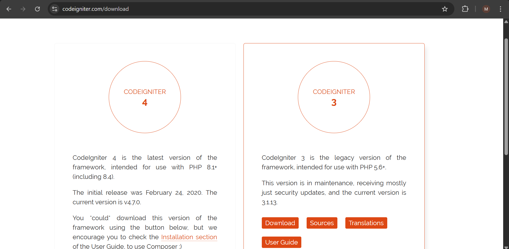


## Menjalankan CLI (Command Line Interface) 
Codeigniter 4 menyediakan CLI untuk mempermudah proses development. Untuk mengakses
CLI buka terminal/command prompt. Arahkan lokasi direktori sesuai dengan direktori kerja project dibuat 

Perintah yang dapat dijalankan untuk memanggil CLI CodeIgniter adalah: 

```
php spark
```

## Mengakftikan Mode Debugging 

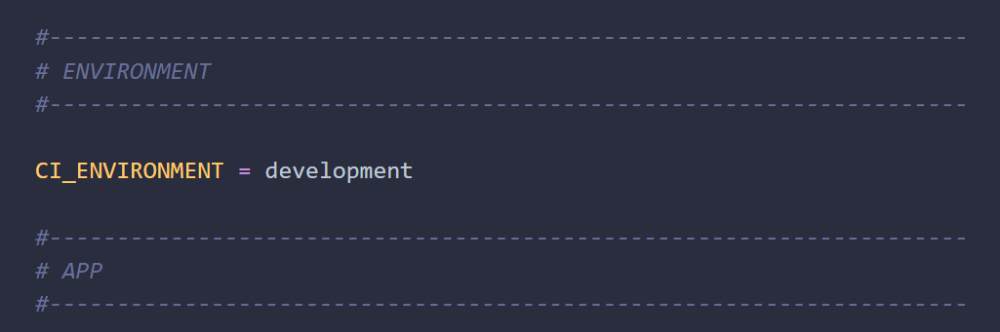

Untuk menampikan jenis error maka kita perlu mengaktikan mode debugging dengan mengubah nilai konfigurasi pada environment variable CI_ENVIRINMENT menjadi development. 

Ubah nama File env menjadi .env kemudian buka file tersebut dan ubah nilai variable  CI_ENVIRINMENT menjadi development. 

## Router dan Controller 

Router terletak pada file app/config/Routes.php 

Pada file tersebut kita dapat mendefinisikan route untuk aplikasi yang kita buat.
```
$routes->get('/', 'Home::index');
```

### Membuat Route Baru 

Tambahkan kode ini diddalam routes.php 
```
$routes->get('/about', 'Page::about');
$routes->get('/contact', 'Page::contact');
$routes->get('/faqs', 'Page::faqs');
```

Untuk mengetahui route yg ditambakan sudah benar atau belum, buka CLI dan jalankan perintah berikut 

```
php spark routes
```

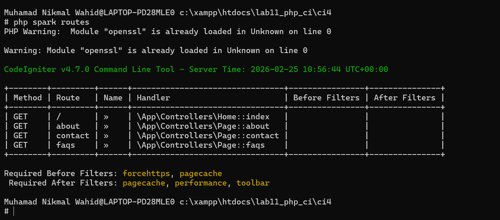


## Membuat Controller 

```
<?php

namespace App\Controllers;

class Page extends BaseController
{
    public function about()
    {
        echo "Ini halaman About";
    }

    public function contact()
    {
        echo "Ini halaman Contact";
    }

    public function faqs()
    {
        echo "Ini halaman FAQ";
    }
}
```

## Membuat View 

Buat File baru dengan nama about.php pada direktori (app/view/about.php)
```
<!DOCTYPE html>
<html lang="en">
<head>
    <meta charset="UTF-8">
    <title><?= $title; ?></title>
    <link rel="stylesheet" href="<?= base_url('styles.css'); ?>">
</head>
<body>

<?= $this->include('template/header.php'); ?>

<h1><?= esc($title); ?></h1>
<hr>
<p><?= esc($content); ?></p>

<?= $this->include('template/footer.php'); ?>

</body>
</html><!DOCTYPE html>
<html lang="en">
<head>
    <meta charset="UTF-8">
    <title><?= $title; ?></title>
    <link rel="stylesheet" href="<?= base_url('styles.css'); ?>">
</head>
<body>


<h1><?= esc($title); ?></h1>
<hr>
<p><?= esc($content); ?></p>


</body>
</html>
```

Ubah method pada abut di dalam class Controller page seperti berikut: 

```
 public function about()
    {
        return view('about', [
            'title' => 'Halaman About',
            'content' => 'Ini adalah halaman about yang menjelaskan tentang isi halaman ini.'
        ]);
    }
```

## Membuat Layout Header dan Footer 


### Header 
```
<!DOCTYPE html>
<html lang="en">
<head>
    <meta charset="UTF-8">
    <title><?= $title; ?></title>
    <link rel="stylesheet" href="<?= base_url('styles.css');?>">
</head>
<body>
    <div id="container">
        <header>
            <h1>Layout Sederhana</h1>
        </header>
        <nav>
            <a href="<?= base_url('/');?>" class="active">Home</a>
            <a href="<?= base_url('/artikel');?>">Artikel</a>
            <a href="<?= base_url('/about');?>">About</a>
            <a href="<?= base_url('/contact');?>">Kontak</a>
        </nav>
<section id="wrapper">
<section id="main">
```

### Footer 
```
</section>

<aside id="sidebar">
    <div class="widget-box">
        <h3 class="title">Widget Header</h3>
        <ul>
            <li><a href="#">Widget Link</a></li>
            <li><a href="#">Widget Link</a></li>
        </ul>
    </div>

    <div class="widget-box">
        <h3 class="title">Widget Text</h3>
        <p>
            Vestibulum lorem elit, iaculis in nisl volutpat,
            malesuada tincidunt arcu.
        </p>
    </div>
</aside>

</section>

<footer>
    <p>&copy; 2021 - Universitas Pelita Bangsa</p>
</footer>

</div>
</body>
</html>
```

## Pertanyaan dan Tugas 

Lengkapi kode program untuk menu lainnya yang ada pada Controller Page, sehingga semua
link pada navigasi header dapat menampilkan tampilan dengan layout yang sama.

Jawaban: 

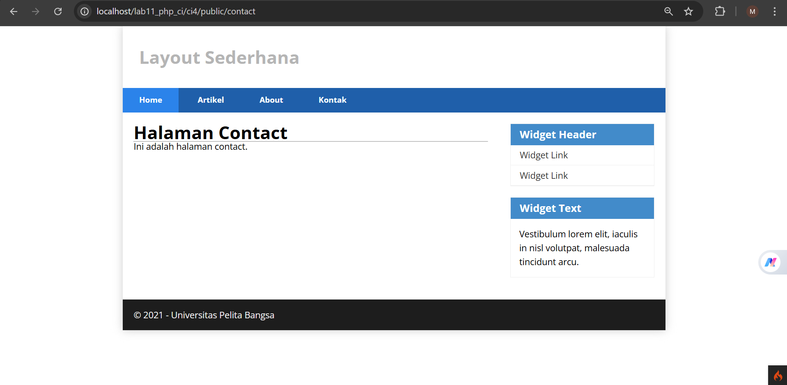

- Buat File baru di dalam direktori (app/view) buat beberapa file yg dibutuhkan misalnya contact.php dan kemudian isi dengan berikut:

```
<!DOCTYPE html>
<html lang="en">
<head>
    <meta charset="UTF-8">
    <title><?= $title; ?></title>
    <link rel="stylesheet" href="<?= base_url('styles.css'); ?>">
</head>
<body>

<?= $this->include('template/header.php'); ?>

<h1><?= esc($title); ?></h1>
<hr>
<p><?= esc($content); ?></p>

<?= $this->include('template/footer.php'); ?>

</body>
</html>
```

Kemudian ubah kode pada Controller Page

```
<?php

namespace App\Controllers;

class Page extends BaseController
{
    public function about()
    {
        return view('about', [
            'title' => 'Halaman About',
            'content' => 'Ini adalah halaman about yang menjelaskan tentang isi halaman ini.'
        ]);
    }

    public function contact()
    {
        return view('contact', [
            'title' => 'Halaman Contact',
            'content' => 'Ini adalah halaman contact.'
        ]);
    }

    public function artikel()
    {
        return view('artikel', [
            'title' => 'Halaman Artikel',
            'content' => 'Ini adalah halaman artikel.'
        ]);
    }

    public function faqs()
    {
        return view('faqs', [
            'title' => 'Halaman FAQ',
            'content' => 'Ini adalah halaman FAQ.'
        ]);
    }

    public function tos()
    {
        return view('tos', [
            'title' => 'Halaman Term of Services',
            'content' => 'Ini adalah halaman Term of Services.'
        ]);
    }
}
```
# Pratikum 2 - Pemrograman Web 2 (Framework Lanjutan CRUD) 

## Persiapan 
Untuk memulai pratikum membuat aplikasi CRUD sederhana, yang perlu disiapkan adalah database srver menggunakan MySQL. Pastikan MySQL dan apache sudah aktif 

## Membuat Database 
Setelah membuat itu kita membuat database dengan nama lab_ci4 setelah itu kita membat tabel 

## Koneksi Database 
Selanjutnya membuat konfigurasi database untuk menghubungkan dengan database server. Konfigurasi dapat dilakukan menggunakan file .env 

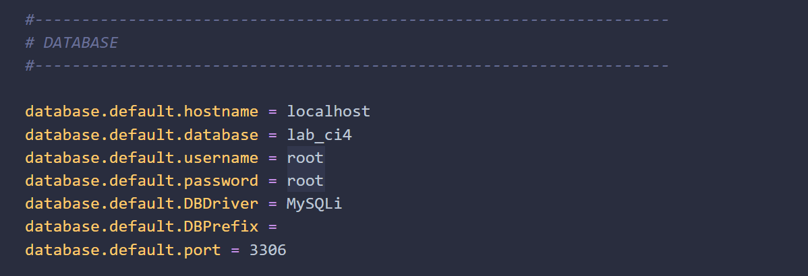

## Membuat Model 
Selanjutnya adalah membuat model untuk memproses data Artikel. Buat File baru pada direktori app/Models dengan nama ArtikelModel.php 

```
<?php
namespace App\Models;

use CodeIgniter\Model;

class ArtikelModel extends Model
{
    protected $table = 'artikel';
    protected $primaryKey = 'id';
    protected $useAutoIncrement = true;
    protected $allowedFields = ['judul', 'isi', 'status', 'slug',
    'gambar'];
}
```

## Membuat Controller 
Buatlah Controller baru dengan nama Artikel.php pada direktori app/Controllers

```
<?php 

namespace App\Controllers; 

use App\Models\ArtikelModel;

class Artikel extends BaseController 
{
    public function index()
    {
        $title = 'Daftar Artikel';
        $model = new ArtikelModel();
        $artikel = $model -> findAll();
        return view('artikel/index', compact('artikel', "title"));
    }
}
```

# Membuat view 
Membuat direktori baru dengan nama artikel pada direktori app/views, kemudian buat file baru dengan nama index.php.

```
<?= $this->include('template/header'); ?>

<?php if ($artikel): ?>
    
    <?php foreach ($artikel as $row): ?>
        
        <article class="entry">
            <h2>
                <a href="<?= base_url('/artikel/' . $row['slug']); ?>">
                    <?= $row['judul']; ?>
                </a>
            </h2>

            " 
                alt="<?= $row['judul']; ?>"
            >

            <p>
                <?= substr($row['isi'], 0, 200); ?>
            </p>
        </article>

        <hr class="divider" />

    <?php endforeach; ?>

<?php else: ?>

    <article class="entry">
        <h2>Belum ada data.</h2>
    </article>

<?php endif; ?>

<?= $this->include('template/footer'); ?>
```

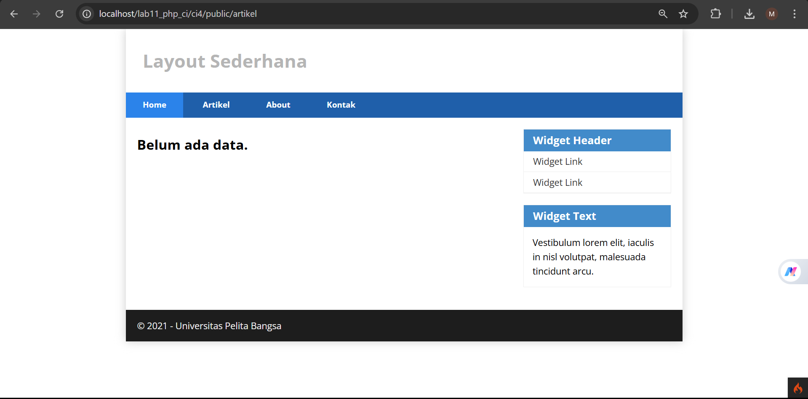 

Selanjutnya kita akan menambah beberapa data pada database agar dapat ditampilkan datanya. 

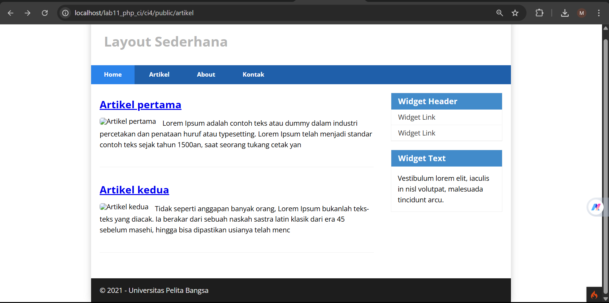

## Membuat Tampilan detail Artikel 

Tampilan pada saat judul berita di klik maka akan diarahkan ke halaman yg berbeda. 
```
  public function view($slug)
    {
        $model = new ArtikelModel();
        $artikel = $model ->where([
            'slug' => $slug
        ])->first();

        // error apabila tidak ada data 

        if (!$artikel)
            {
                throw PageNotFoundException:: forPageNotFound();
            }

            $title = $artikel['judul'];
            return view('artikel/detail', compact('artikel', 'title'));
    }
```

## Membuat View Detail 

```
<?= $this->include('template/header'); ?> 

<article class="entry">
    <h2><?= $artikel['judul']; ?></h2>
    " alt="<?=$artikel['judul']; ?>">
    <p><?= $artikel['isi']; ?></p>
</article>

<?= $this->include('template/footer'); ?> 
```
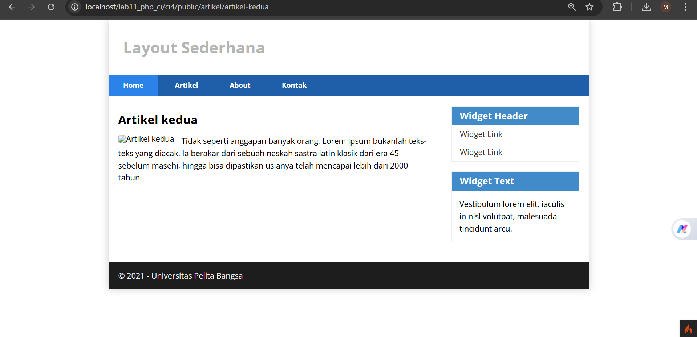

## Membuat Routing untuk artikel detail 
Membuat routing tambahan untuk artikel detail 
```
$routes->get('/artikel/(:any)', 'Artikel::view/$1');
```

## Membuat Menu Admin 
Menu Admin adalah untuk proses CRUD data. buat method baru pada COntroller artikel denngan nama method admin_index()
```
  public function admin_index()
    {
        $title = 'Daftar Artikel';
        $model = new ArtikelModel();
        $artikel = $model->findAll();
        return view('artikel/admin_index', compact('artikel', 'title'));
    }
```
Langkah selanjutnya adalah membuat tampilan admin dengan nama file admin_index.php
```
<?= $this->include('template/admin_header'); ?>

<table class="table">
    <thead>
        <tr>
            <th>ID</th>
            <th>Judul</th>
            <th>Status</th>
            <th>Aksi</th>
        </tr>
    </thead>
    <tbody>
        <?php if (!empty($artikel)) : ?>
            <?php foreach ($artikel as $row) : ?>
                <tr>
                    <td><?= $row['id']; ?></td>
                    <td>
                        <b><?= esc($row['judul']); ?></b>
                        <p>
                            <small><?= esc(substr($row['isi'], 0, 50)); ?>...</small>
                        </p>
                    </td>
                    <td><?= esc($row['status']); ?></td>
                    <td>
                        <a class="btn" href="<?= base_url('admin/artikel/edit/' . $row['id']); ?>">
                            Ubah
                        </a>

                        <a class="btn btn-danger"
                           onclick="return confirm('Yakin menghapus data?');"
                           href="<?= base_url('admin/artikel/delete/' . $row['id']); ?>">
                            Hapus
                        </a>
                    </td>
                </tr>
            <?php endforeach; ?>
        <?php else : ?>
            <tr>
                <td colspan="4" class="text-center">Belum ada data.</td>
            </tr>
        <?php endif; ?>
    </tbody>
    <tfoot>
        <tr>
            <th>ID</th>
            <th>Judul</th>
            <th>Status</th>
            <th>Aksi</th>
        </tr>
    </tfoot>
</table>

<?= $this->include('template/admin_footer'); ?>
```

kemudian tambah routing untuk menu admin 
```
$routes->group('admin', function($routes) {
    $routes->get('artikel', 'Artikel::admin_index');
    $routes->add('artikel/add', 'Artikel::add');
    $routes->add('artikel/edit/(:any)', 'Artikel::edit/$1');
    $routes->get('artikel/delete/(:any)', 'Artikel::delete/$1');
});
```

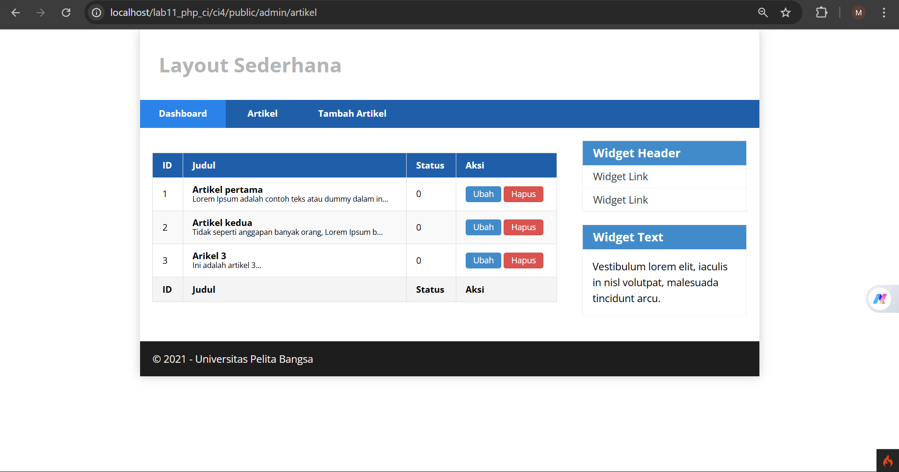

## Menambah Data Artikel 

```
public function add()
    {
        // Validasi input
        $validation = \Config\Services::validation();
        $validation->setRules([
            'judul' => 'required'
        ]);

        $isDataValid = $validation
            ->withRequest($this->request)
            ->run();

        if ($isDataValid)
        {
            $model = new ArtikelModel();

            $model->insert([
                'judul' => $this->request->getPost('judul'),
                'isi'   => $this->request->getPost('isi'),
                'slug'  => url_title(
                    $this->request->getPost('judul'),
                    '-', 
                    true
                ),
            ]);

            return redirect()->to('/admin/artikel');
        }

        $title = "Tambah Artikel";
        return view('artikel/form_add', compact('title'));
    }
```
Kemudian agar bisa melihat form tambah kita harus membuat file baru bernama form_add.php 

```
<?= $this->include('template/admin_header'); ?>

<h2><?= $title; ?></h2>
<form action="" method="post">
    <p>
    <input type="text" name="judul">
    </p>

    <p>
    <textarea name="isi" cols="50" rows="10"></textarea>
    </p>
    <p><input type="submit" value="Kirim" class="btn btn-large"></p>
</form>
<?= $this->include('template/admin_footer'); ?>
```

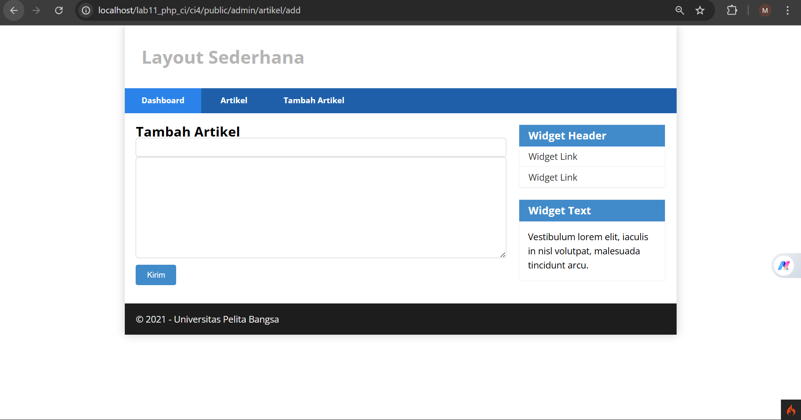

## Mengubah Data 
Tambahkan method baru pada controller dengan nama edit()
```
 public function edit($id)
    {
        $model = new ArtikelModel();

        // Ambil data lama terlebih dahulu
        $data = $model->find($id);

        if (!$data) {
            throw new \CodeIgniter\Exceptions\PageNotFoundException("Data tidak ditemukan");
        }

        // Validasi input
        $validation = \Config\Services::validation();
        $validation->setRules([
            'judul' => 'required'
        ]);

        $isDataValid = $validation
            ->withRequest($this->request)
            ->run();

        if ($isDataValid)
        {
            $model->update($id, [
                'judul' => $this->request->getPost('judul'),
                'isi'   => $this->request->getPost('isi'),
                'slug'  => url_title(
                    $this->request->getPost('judul'),
                    '-', 
                    true
                ),
            ]);

            return redirect()->to('/admin/artikel');
        }

        $title = "Edit Artikel";
        return view('artikel/form_edit', compact('title', 'data'));
    }
```

Membuat view edit dengan cara membuat file baru dengan nama form_edit.php 
```
<?= $this->include('template/admin_header'); ?>

<h2><?= esc($title); ?></h2>

<form action="" method="post">
    
    <?= csrf_field(); ?>

    <p>
        <input 
            type="text" 
            name="judul" 
            value="<?= esc($data['judul']); ?>" 
            required
        >
    </p>

    <p>
        <textarea 
            name="isi" 
            cols="50" 
            rows="10"
        ><?= esc($data['isi']); ?></textarea>
    </p>

    <p>
        <input 
            type="submit" 
            value="Kirim" 
            class="btn btn-large"
        >
    </p>

</form>

<?= $this->include('template/admin_footer'); ?>
```
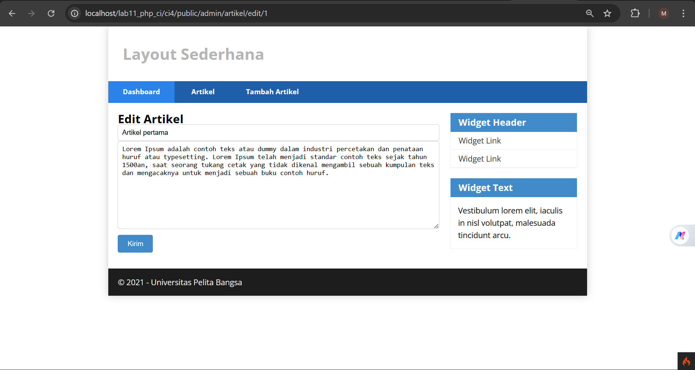

## Menghapus Data 
```
public function delete($id)
{
    $artikel = new ArtikelModel();

    $artikel->delete($id);

    return redirect()->to('/admin/artikel');
}
```

## Pernyataan dan Tugas

Selesaikan programnya sesuai Langkah-langkah yang ada. Anda boleh melakukan improvisasi.

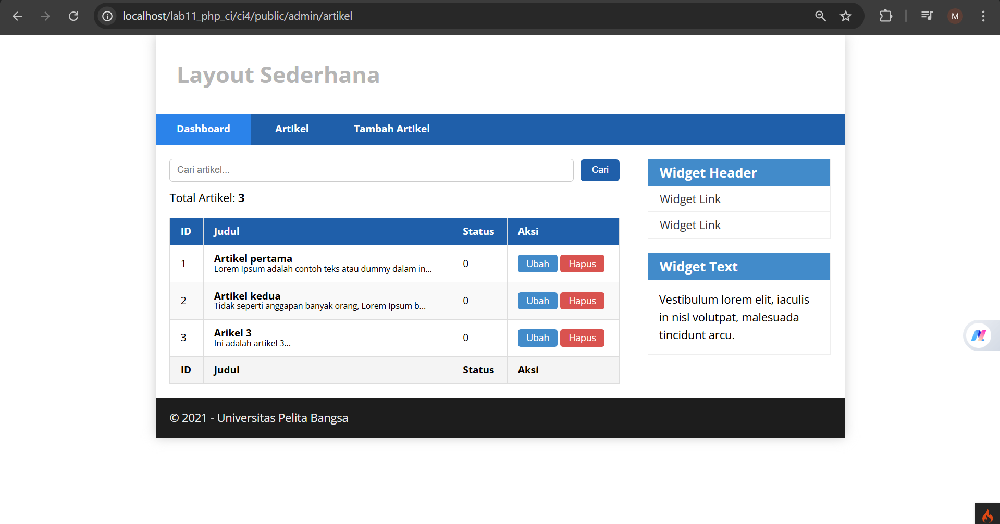

Improvisasi yang saya lakukan adalah menambahkan total artikel serta fitur search agar memudahkan dalam mencari artikel

# Pratikum 3 - View Layout dan View Cell 

Pratikum 3 menggunakan konsep View Layout dan View Cell untuk memudahkan dalam penggunaan layout. 

### Membuat Layout utama 

Buat folder layout di dalam app/views/, kemudian membuat file main.php di dalam folder layout dengan kode berikut. 

```
<!DOCTYPE html>
<html lang="en">
<head>
    <meta charset="UTF-8">
    <title><?= $title ?? 'My Website' ?></title>
    <link rel="stylesheet" href="<?= base_url('styles.css'); ?>">
</head>
<body>
    <div id="container">
        
        <header>
            <h1>Layout Sederhana</h1>
        </header>

        <nav>
            <a href="<?= base_url('/'); ?>" class="active">Home</a>
            <a href="<?= base_url('/artikel'); ?>">Artikel</a>
            <a href="<?= base_url('/about'); ?>">About</a>
            <a href="<?= base_url('/contact'); ?>">Kontak</a>
        </nav>

        <section id="wrapper">
            
            <section id="main">
                <?= $this->renderSection('content') ?>
            </section>

            <aside id="sidebar">
                
                <?= view_cell('App\\Cells\\ArtikelTerkini::show') ?>

                <div class="widget-box">
                    <h3 class="title">Widget Header</h3>
                    <ul>
                        <li><a href="#">Widget Link</a></li>
                        <li><a href="#">Widget Link</a></li>
                    </ul>
                </div>

                <div class="widget-box">
                    <h3 class="title">Widget Text</h3>
                    <p>
                        Vestibulum lorem elit, iaculis in nisl volutpat,
                        malesuada tincidunt arcu. Proin in leo fringilla,
                        vestibulum mi porta, faucibus felis. Integer pharetra
                        est nunc, nec pretium nunc pretium ac.
                    </p>
                </div>

            </aside>

        </section>

        <footer>
            <p>&copy; 2021 - Universitas Pelita Bangsa</p>
        </footer>

    </div>
</body>
</html> 
```

### Modifikasi File View 

Ubah app/Views/home.php agar sesuai dengan layout baru 

```
<?= $this->extend('layout/main') ?>

<?= $this->section('content') ?>

<h1><?= $title; ?></h1>
<hr>
<p><?= $content; ?></p>

<?= $this->endSection() ?>
```

### Menampilkan Data Dinamis dengan VIew Cell 

View Cell adalah sebuah konsep untuk membuat komponen tampilan (view) yang bersifat modular, reusable, dan memiliki logika tersendiri tanpa harus membebani controller utama.

### Membuat Class View Cell 

Buat folder Cells di dalam app/, kemudian file ArtikelTerkini.php di dalam app/Cells dengan kode berikut.

```
<?php

namespace App\Cells;

use CodeIgniter\View\Cell;
use App\Models\ArtikelModel;

class ArtikelTerkini extends Cell
{
    public function render()
    {
        $model = new ArtikelModel();

        $artikel = $model->orderBy('created_at', 'DESC')
                         ->limit(5)
                         ->findAll();

        return view('components/artikel_terkini', [
            'artikel' => $artikel
        ]);
    }
}
```

### Membuat View untuk View Cell 

Buat Folder components di dalam app/Views/, Kemudian buat file artikel_terkini.php di dalam app/Views/components dengan kode berikut: 

```
<h3>Artikel Terkini</h3>

<ul>
    <?php foreach ($artikel as $row): ?>
        <li>
            <a href="<?= base_url('/artikel/' . $row['slug']) ?>">
                <?= $row['judul'] ?>
            </a>
        </li>
    <?php endforeach; ?>
</ul>
```

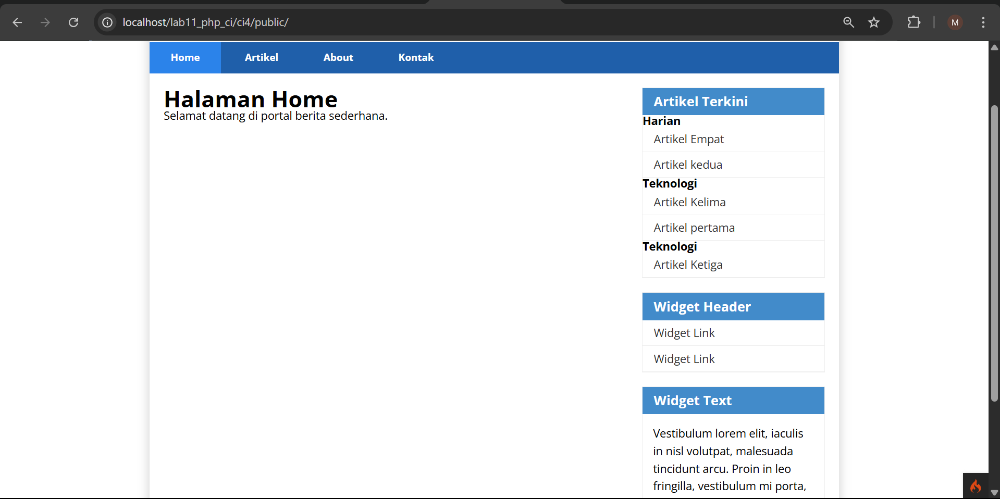

### Pertanyaan dan Tugas 

- Sesuaikan data dengan praktikum sebelumnya, perlu melakukan perubahan field pada
database dengan menambahkan tanggal agar dapat mengambil data artikel terbaru.


- Selesaikan programnya sesuai Langkah-langkah yang ada. Anda boleh melakukan
improvisasi.

- Apa manfaat utama dari penggunaan View Layout dalam pengembangan aplikasi?
  
  View Layout adalah template utama (master page) yang digunakan untuk membungkus konten halaman agar konsisten di seluruh aplikasi. Terdapat beberapa manfaat penggunaan view layout yaitu konsistensi UI/UX, Efisisnesi Development, Maintainability (Kemudahan Maintenance), Separation of Concerns (SoC), ntegrasi Komponen Lebih Mudah

- Jelaskan perbedaan antara View Cell dan View biasa.

  View Biasa adalah File tampilan yang hanya bertugas menampilkan data dari controller. Sedangkan View Cell adalah Komponen view yang memiliki logic sendiri (mini-controller) dan dapat mengambil data secara mandiri

# Pratikum 4 - Framework Lanjutan (Modul Login)

Pada pratikum 4 ini akan membuat modul login, hal yang perlu disiapkan adalah database  menggunakan MySQL. 

### Membuat Tabel User 

```
CREATE TABLE user (
    id INT(11) auto_increment,
    username VARCHAR(200) NOT NULL,
    useremail VARCHAR(200),
    userpassword VARCHAR(200),
    PRIMARY KEY(id)
);
```

### Membuat Model User 

```
<?php

namespace App\Models;

use CodeIgniter\Model;

class UserModel extends Model
{
    protected $table = 'user';
    protected $primaryKey = 'id';
    protected $useAutoIncrement = true;
    protected $allowedFields = ['username', 'useremail', 'userpassword'];
}
```
### Membuat Controller User

Langkah Selanjutnya membuat Controller baru dengan nama User.php pada direktori app/controllers. Kemudian tambahkan method index() untuk menampilkan daftar user dan method login() untuk proses login. 

```
<?php
namespace App\Controllers;

use App\Models\UserModel;

class User extends BaseController
{
    public function index()
    {
        $title = 'Daftar User';
        $model = new UserModel();
        $users = $model->findAll();

        return view('user/index', compact('users', 'title'));
    }

    public function login()
    {
        helper(['form']);

        $email = $this->request->getPost('email');
        $password = $this->request->getPost('password');

        if (!$email) {
            return view('/login');
        }

        $session = session();
        $model = new UserModel();
        $login = $model->where('useremail', $email)->first();

        if ($login) {
            $pass = $login['userpassword'];

            if (password_verify($password, $pass)) {
                $login_data = [
                    'user_id' => $login['id'],
                    'user_name' => $login['username'],
                    'user_email' => $login['useremail'],
                    'logged_in' => TRUE,
                ];

                $session->set($login_data);

                return redirect()->to('admin/artikel');
            } else {
                $session->setFlashdata("flash_msg", "Password salah.");
                return redirect()->to('/login');
            }
        } else {
            $session->setFlashdata("flash_msg", "Email tidak terdaftar.");
            return redirect()->to('/user/login');
        }
    }
}
```

### Membuat View Login 

Pada direktori app/views buat file baru dengan nama login.php 

```
<!DOCTYPE html>
<html lang="en">
<head>
    <meta charset="UTF-8">
    <title><?= $title ?? 'My Website' ?></title>
    <link rel="stylesheet" href="<?= base_url('styles.css'); ?>">
</head>
<body>
    <div id="container">
        
        <header>
            <h1>Layout Sederhana</h1>
        </header>

        <nav>
            <a href="<?= base_url('/'); ?>" class="active">Home</a>
            <a href="<?= base_url('/artikel'); ?>">Artikel</a>
            <a href="<?= base_url('/about'); ?>">About</a>
            <a href="<?= base_url('/contact'); ?>">Kontak</a>
        </nav>

        <section id="wrapper">
            
            <section id="main">
                <?= $this->renderSection('content') ?>
            </section>

            <aside id="sidebar">
                
                <?= view_cell('App\\Cells\\ArtikelTerkini::show') ?>

                <div class="widget-box">
                    <h3 class="title">Widget Header</h3>
                    <ul>
                        <li><a href="#">Widget Link</a></li>
                        <li><a href="#">Widget Link</a></li>
                    </ul>
                </div>

                <div class="widget-box">
                    <h3 class="title">Widget Text</h3>
                    <p>
                        Vestibulum lorem elit, iaculis in nisl volutpat,
                        malesuada tincidunt arcu. Proin in leo fringilla,
                        vestibulum mi porta, faucibus felis. Integer pharetra
                        est nunc, nec pretium nunc pretium ac.
                    </p>
                </div>

            </aside>

        </section>

        <footer>
            <p>&copy; 2021 - Universitas Pelita Bangsa</p>
        </footer>

    </div>
</body>
</html> 
```

### Membuat Database Seeder

Dalam konteks pengembangan aplikasi (terutama pada framework seperti CodeIgniter), Database Seeder adalah mekanisme untuk mengisi database dengan data awal (dummy atau default) secara otomatis. Untuk mengaktifkan database seeder kita perlu membuka CLI dan menulis kan perintah sebagai berikut ```php spark make:seeder UserSeeder```

Langkah Selanjutnya adalah mengisi file UserSeeder.php yang berada di lokasi direktori, lalu isi dengan kode berikut. 

```
<?php

namespace App\Database\Seeds;

use CodeIgniter\Database\Seeder;
use App\Models\UserModel;

class UserSeeder extends Seeder
{
    public function run()
    {
        $model = new UserModel();

        $model->insert([
            'username'     => 'admin',
            'useremail'    => 'admin@email.com',
            'userpassword' => password_hash('admin123', PASSWORD_DEFAULT),
        ]);
    }
}
```

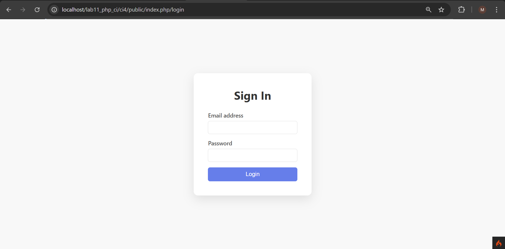

Setelah kita mengisi file UserSeeds dengan kode tersebut langkah selanjutnya adalah kembali membuka CLI dan ketik perintah berikut: 

```
php spark db:seed UserSeeder
```

### Menambahkan Auth Filter 

```
<?php

namespace App\Filters;

use CodeIgniter\HTTP\RequestInterface;
use CodeIgniter\HTTP\ResponseInterface;
use CodeIgniter\Filters\FilterInterface;

class Auth implements FilterInterface
{
    public function before(RequestInterface $request, $arguments = null)
    {
        // jika user belum login
        if (!session()->get('logged_in')) {
            // maka redirect ke halaman login
            return redirect()->to('/user/login');
        }
    }

    public function after(RequestInterface $request, ResponseInterface $response, $arguments = null)
    {
        // Do something here
    }
}
```

Selanjutnya buka file app/Config/Filter.php tambahkan kode ini 

```
'auth' => App\Filters\Auth::class
```

### Percobaan Akses Menu Admin 


### Fungai Logout

```
public function logout()
{
    session()->destroy();
    return redirect()->to('/user/login');
}
```

# Pratikum 5: Pagination dan Pencarian 

## Langkah-langkah pratikum 

### Membuat pagination 

Pagination adalah suatu teknik dalam pengembangan aplikasi yang digunakan untuk membagi data dalam jumlah besar menjadi beberapa bagian atau halaman yang lebih kecil. Teknik ini sangat umum digunakan pada aplikasi berbasis web maupun mobile, terutama ketika sistem harus menampilkan data dalam jumlah banyak seperti daftar artikel, produk, atau pengguna.

Tujuan dan fungsi pagination 
1. Meningkatkan Performa Aplikasi
2. Mengurangi Waktu Loading
3. Mempermudah Navigasi Data
4. Meningkatkan Kerapihan Tampilan
5. Efisiensi Penggunaan Sumber Daya

Untuk membuat pagination kita perlu membuka kembali Controller Artikel kemudian modikasi kode pada method admin_index 
```
    public function admin_index()
    {
        $title = 'Daftar Artikel';
        $model = new ArtikelModel();
        $data = [
        'title' => $title,
        'artikel' => $model->paginate(10), #data dibatasi 10 record
        per halaman
        'pager' => $model->pager,
        ];
        return view('artikel/admin_index', $data);
    }
```
Kemudian buka file views/artikel/admin_index.php dan tambahkan kode berikut
dibawah deklarasi tabel data.
```
<?= $pager->links(); ?>
```

### Membuat Pencarian 

Pencarian (Search) adalah fitur yang digunakan untuk menemukan data tertentu berdasarkan kata kunci (keyword) yang dimasukkan oleh pengguna. Fitur ini biasanya terintegrasi dengan database untuk memfilter data sesuai dengan input pengguna.

Tujuan Dan Fungsi Pencarian 
1. Mempercepat Proses Pencarian Data
2. Meningkatkan Efisiensi Penggunaan Aplikasi
3. Meningkatkan Pengalaman Pengguna
4. Mempermudah Akses Informasi Spesifik
5. Mendukung Pengumpulan Aplikasi

Untuk membuat search kita perlu menambahkan kode pada admin_index.php 
```
<form method="get" class="admin-search">
    <input type="text" name="q" placeholder="Cari artikel...">
    <button type="submit" class="btn">Cari</button>
</form>
```

Dan Ubah Link Pager menjadi seperti ini 
```
<?= $pager->only(['q'])->links(); ?>
```

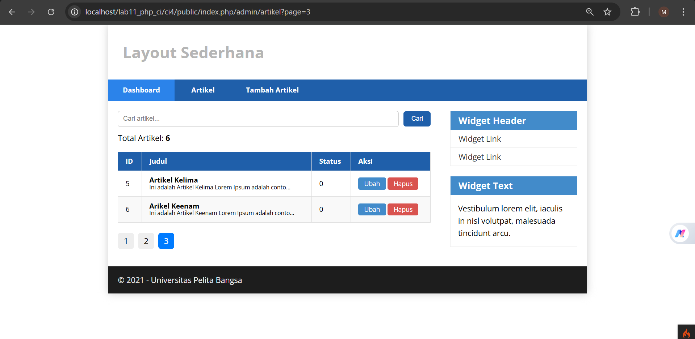

## Pertanyaan dan Tugas 

Selesaikan programnya sesuai Langkah-langkah yang ada. Anda boleh melakukan improvisasi.

## Improvivasi 

Mengubah Sedikit Controller karena sebelumnya sudah ditambahkan total artikel pada program. Proses pencarian dilakukan dengan mengambil input pengguna melalui parameter HTTP GET, kemudian memfilter data menggunakan metode like() sehingga hanya data yang sesuai dengan kata kunci yang ditampilkan. Selanjutnya, pagination diterapkan menggunakan metode paginate() untuk membatasi jumlah data yang ditampilkan per halaman, sehingga sistem hanya memuat sebagian data sesuai kebutuhan dan mengurangi beban server. Selain itu, jumlah total data dihitung menggunakan countAll() untuk keseluruhan data atau countAllResults() ketika pencarian aktif, sehingga informasi yang ditampilkan tetap akurat dan relevan. Integrasi antara searching dan pagination memungkinkan data yang telah difilter tetap dibagi ke dalam beberapa halaman secara dinamis, sehingga meningkatkan performa sistem sekaligus memberikan pengalaman pengguna yang lebih baik, terstruktur, dan mudah dalam menavigasi data.

```
public function admin_index()
    {
        $model = new ArtikelModel();
        $q = $this->request->getGet('q');

        if ($q) {
            $model->like('judul', $q);
        }

        $artikel = $model->paginate(2);
        $pager = $model->pager;

        // total sesuai kondisi
        if ($q) {
            $total = $model->like('judul', $q)->countAllResults();
        } else {
            $total = $model->countAll();
        }

        return view('artikel/admin_index', [
            'title'   => 'Daftar Artikel',
            'artikel' => $artikel,
            'pager'   => $pager,
            'total'   => $total,
            'q'       => $q
        ]);
    }
```
## Menambahkan Custom_Pagination.php 

Menambahkan custom_pagination pada program bertujuan agar memudahkan dalam memodifikasi tampilan pagination. Untuk membuat custom_pagination.php kita harus membuat folder Pager pada direktori Views, lalu isi dengan kode ini 

```
<ul class="pagination-custom">
    <?php foreach ($pager->links() as $link) : ?>
        <li class="<?= $link['active'] ? 'active' : '' ?>">
            <a href="<?= $link['uri'] ?>">
                <?= $link['title'] ?>
            </a>
        </li>
    <?php endforeach ?>
</ul>
```
CSS
```
.pagination-custom {
    list-style: none;
    display: flex;
    gap: 8px;
    padding: 0;
    margin-top: 30px;
}

.pagination-custom li a {
    padding: 6px 12px;
    background: #eee;
    text-decoration: none;
    border-radius: 6px;
    color: black;
}

.pagination-custom li.active a {
    background: #007bff;
    color: white;
}
```

 

# Pratikum 6 

## Relasi Tabel dan Query Builder 

Pratikum ini merupakan tahap lanjutan dari pembelajaran sebelumnya yang berfokus pada penguatan pemahaman terhadap arsitektur aplikasi berbasis MVC (Model-View-Controller), khususnya pada aspek pengelolaan data menggunakan Model, Implementasi relasi antar tabel, serta pemanfaatan Query builder dalam framework CodeIgniter 4. Pendekatan ini bertujuan untuk meningkatkan efisiensi dan skalabilitas dalam pengembangan aplikasi berbasis database.

## 1. Model Dalam CodeIgniter. 

Model merupakan komponen inti dalam pola arsitektur MVC yang berfungsi sebagai lapisan penghubung antara aplikasi dan database. Melalui Model, seluruh operasi terhadap data seperti proses pengambilan (retrieve), penyimpanan (insert), pembaruan (update), dan penghapusan (delete) dapat dilakukan secara terstruktur. Dengan adanya Model, logika pengolahan data menjadi terpisah dari tampilan (View) dan alur kontrol (Controller), sehingga meningkatkan modularitas dan maintainability kode.

## 2. Relasi Antar Tabel 

Relasi tabel digunakan untuk membangun keterkaitan logis antara dua atau lebih tabel dalam sebuah database relasional. Pada praktikum ini, digunakan pendekatan One-to-Many relationship, di mana satu entitas kategori dapat memiliki lebih dari satu entitas artikel. Implementasi relasi ini biasanya dilakukan dengan menambahkan foreign key pada tabel anak (artikel) yang merujuk ke primary key pada tabel induk (kategori). Dengan struktur ini, integritas data dapat terjaga dan redundansi dapat diminimalkan.

## 3. Query Builder

Query Builder merupakan fitur yang disediakan oleh CodeIgniter untuk mempermudah proses penyusunan query database tanpa harus menuliskan sintaks SQL secara langsung. Melalui Query Builder, pengembang dapat melakukan berbagai operasi seperti:

- penggabungan tabel(join),
- penyaringan data(filtering),
- pengurutan data(ordering),
- serta pembatasan hasil(pagination)

Pendekatan ini tidak hanya meningkatkan efisiensi penulisan kode, tetapi juga membantu mengurangi risiko kesalahan sintaks serta meningkatkan keamanan, terutama terhadap serangan seperti SQL Injection.


## Langkah-langkah Pratikum 

### 1. Membuat Tabel Kategori 

```
CREATE TABLE kategori (
    id_kategori INT(11) AUTO_INCREMENT,
    nama_kategori VARCHAR(100) NOT NULL,
    slug_kategori VARCHAR(100),
    PRIMARY KEY (id_kategori)
);
```

### 2. Mengubah Tabel Artikel 

Menambahkan foreign key 'id_kategori' pada tabel artikel untuk membuat relasi dengan tabel 'kategori'

```
ALTER TABLE artikel
ADD COLUMN id_kategori INT(11),
ADD CONSTRAINT fk_kategori_artikel
FOREIGN KEY (id_kategori) REFERENCES kategori(id_kategori);
```

### 3. Membuat Model Kategori

Membuat file model baru di app/Models dengan nama KategoriModel.php:

```
<?php
namespace App\Models;
use CodeIgniter\Model;
class KategoriModel extends Model
{
    protected $table = 'kategori';
    protected $primaryKey = 'id_kategori';
    protected $useAutoIncrement = true;
    protected $allowedFields = [nama_kategori', 'slug_kategori'];
}
```

### 4. Memodifikasi ArtikelModel.php 

```
<?php

namespace App\Models;

use CodeIgniter\Model;

class ArtikelModel extends Model
{
   protected $table = 'artikel';
   protected $primaryKey = 'id';
   protected $useAutoIncrement = true;
   protected $allowedFields = ['judul', 'isi', 'status', 'slug', 'gambar', 'id_kategori'];

   public function getArtikelDenganKategori()
   {
      return $this->db->table('artikel')
                  ->select('artikel.*, kategori.nama_kategori')
                  ->join('kategori', 'kategori.id_kategori = artikel.id_kategori')
                  ->get()
                  ->getResultArray();
   }
}
```

Penjelasan: 

- Menambahkan field id_kategori sebagai foreign key
- Method getArtikelDenganKategori():
  - select() → mengambil semua data artikel + nama kategori
  - join() → menghubungkan tabel artikel dan kategori
  - getResultArray() → hasil dalam bentuk array
- Fungsi ini digunakan untuk menampilkan data relasi

### 5. Memodifikasi Controller Artikel 

```
<?php 

namespace App\Controllers; 

use App\Models\ArtikelModel;   
use App\Models\KategoriModel;
use CodeIgniter\Exceptions\PageNotFoundException;

class Artikel extends BaseController 
{
    public function index()
    {
        $title = 'Daftar Artikel';
        $model = new ArtikelModel();

        $artikel = $model
            ->select('artikel.*, kategori.nama_kategori')
            ->join('kategori', 'kategori.id_kategori = artikel.id_kategori', 'left')
            ->findAll();

        return view('artikel/index', compact('artikel', 'title'));
    }

    public function view($slug)
    {
        $model = new ArtikelModel();

        $artikel = $model
            ->select('artikel.*, kategori.nama_kategori')
            ->join('kategori', 'kategori.id_kategori = artikel.id_kategori', 'left')
            ->where('slug', $slug)
            ->first();

        if (!$artikel) {
            throw \CodeIgniter\Exceptions\PageNotFoundException::forPageNotFound();
        }

        $title = $artikel['judul'];

        return view('artikel/detail', compact('artikel', 'title'));
    }

  public function admin_index()
    {
        $model = new ArtikelModel();
        $kategoriModel = new KategoriModel();

        $q = $this->request->getGet('q');
        $kategori_id = $this->request->getGet('kategori_id');

        $builder = $model->select('artikel.*, kategori.nama_kategori')
            ->join('kategori', 'kategori.id_kategori = artikel.id_kategori', 'left');

        if ($q) {
            $builder->like('artikel.judul', $q);
        }

        if ($kategori_id) {
            $builder->where('artikel.id_kategori', $kategori_id);
        }

        $artikel = $builder->paginate(2);
        $pager = $model->pager;

        return view('artikel/admin_index', [
            'title'       => 'Daftar Artikel',
            'artikel'     => $artikel,
            'pager'       => $pager,
            'q'           => $q,
            'kategori_id' => $kategori_id,
            'kategori'    => $kategoriModel->findAll()
        ]);
    }

    public function add()
    {
        $validation = \Config\Services::validation();
        $validation->setRules([
            'judul' => 'required'
        ]);

        $isDataValid = $validation
            ->withRequest($this->request)
            ->run();

        if ($isDataValid)
        {
            $model = new ArtikelModel();

          
           $model->insert([
            'judul'       => $this->request->getPost('judul'),
            'isi'         => $this->request->getPost('isi'),
            'id_kategori' => $this->request->getPost('id_kategori'), /
            'slug'        => url_title(
                $this->request->getPost('judul'),
                '-', 
                true
            ),
        ]);

            return redirect()->to('/admin/artikel');
        }

        $title = "Tambah Artikel";

        $kategoriModel = new KategoriModel();

        return view('artikel/form_add', [
            'title'    => $title,
            'kategori' => $kategoriModel->findAll()
        ]);
    }

    public function edit($id)
    {
        $model = new ArtikelModel();
        $kategoriModel = new KategoriModel();

        // Ambil data artikel
        $artikel = $model->find($id);

        if (!$artikel) {
            throw new \CodeIgniter\Exceptions\PageNotFoundException("Data tidak ditemukan");
        }

        // Validasi
        $validation = \Config\Services::validation();
        $validation->setRules([
            'judul' => 'required'
        ]);

        $isDataValid = $validation
            ->withRequest($this->request)
            ->run();

        if ($isDataValid)
        {
            $model->update($id, [
                'judul'       => $this->request->getPost('judul'),
                'isi'         => $this->request->getPost('isi'),
                'id_kategori' => $this->request->getPost('id_kategori'),
                'slug'        => url_title(
                    $this->request->getPost('judul'),
                    '-', 
                    true
                ),
            ]);

            return redirect()->to('/admin/artikel');
        }

        $title = "Edit Artikel";

        return view('artikel/form_edit', [
            'title'    => $title,
            'artikel'  => $artikel,
            'kategori' => $kategoriModel->findAll()
        ]);
    }

    public function delete($id)
    {
        $artikel = new ArtikelModel();

        $artikel->delete($id);

        return redirect()->to('/admin/artikel');
    }

    public function render(string $kategori = null)
    {
        $model = new ArtikelModel();

        $query = $model
            ->select('artikel.*, kategori.nama_kategori')
            ->join('kategori', 'kategori.id_kategori = artikel.id_kategori', 'left')
            ->orderBy('artikel.id', 'DESC'); // aman

        if ($kategori) {
            $query->where('kategori.nama_kategori', $kategori);
        }

        $artikel = $query->limit(5)->findAll();

        echo $model->getLastQuery();
        die;

        return view('components/artikel_terkini', [
            'artikel'  => $artikel,
            'kategori' => $kategori 
        ]);
    }
}
```

### 6. Memodifikasi View 

Index.php

```
<?= $this->include('template/header'); ?>

<?php if ($artikel): ?>

    <?php foreach ($artikel as $row): ?>

        <article class="entry">
            <h2>
                <a href="<?= base_url('/artikel/' . $row['slug']); ?>">
                    <?= esc($row['judul']); ?>
                </a>
            </h2>

            <p>
                Kategori: <?= esc($row['nama_kategori']); ?>
            </p>

            " 
                alt="<?= esc($row['judul']); ?>"
            >

            <p>
                <?= esc(substr($row['isi'], 0, 200)); ?>...
            </p>
        </article>

        <hr class="divider" />

    <?php endforeach; ?>

<?php else: ?>

    <article class="entry">
        <h2>Belum ada data.</h2>
    </article>

<?php endif; ?>

<?= $this->include('template/footer'); ?>
```

Penjelasan: 

- Menambahkan kode baru `<p>Kategori: <?= $row['nama_kategori'] ?></p>` untuk menampilkan nama kategori hasil join dan Data ini berasal dari ArtikelModel.

Admin_index.php 
```
<?= $this->include('template/admin_header'); ?>

<h2><?= esc($title); ?></h2>

<!-- SEARCH + FILTER -->
<form method="get" class="admin-search">
    
    <input 
        type="text" 
        name="q" 
        value="<?= esc($q); ?>" 
        placeholder="Cari artikel..."
        class="search-input"
    >

    <select name="kategori_id" class="search-select">
        <option value="">Semua Kategori</option>
        <?php foreach ($kategori as $k): ?>
            <option 
                value="<?= $k['id_kategori']; ?>" 
                <?= ($kategori_id == $k['id_kategori']) ? 'selected' : ''; ?>
            >
                <?= esc($k['nama_kategori']); ?>
            </option>
        <?php endforeach; ?>
    </select>

    <button type="submit" class="btn search-btn">Cari</button>

</form>

<p>Total Artikel: <b><?= $total ?? count($artikel); ?></b></p>

<table class="table">
    <thead>
        <tr>
            <th>ID</th>
            <th>Judul</th>
            <th>Kategori</th>
            <th>Status</th>
            <th>Aksi</th>
        </tr>
    </thead>

    <tbody>
        <?php if (!empty($artikel)) : ?>
            <?php foreach ($artikel as $row) : ?>
                <tr>
                    <td><?= $row['id']; ?></td>

                    <td>
                        <b><?= esc($row['judul']); ?></b>
                        <p>
                            <small><?= esc(substr($row['isi'], 0, 50)); ?>...</small>
                        </p>
                    </td>

                    <td><?= esc($row['nama_kategori']); ?></td>

                    <td><?= esc($row['status']); ?></td>

                    <td>
                        <a class="btn" href="<?= base_url('admin/artikel/edit/' . $row['id']); ?>">
                            Ubah
                        </a>

                        <a 
                            class="btn btn-danger"
                            onclick="return confirm('Yakin menghapus data?');"
                            href="<?= base_url('admin/artikel/delete/' . $row['id']); ?>"
                        >
                            Hapus
                        </a>
                    </td>
                </tr>
            <?php endforeach; ?>
        <?php else : ?>
            <tr>
                <td colspan="5" class="text-center">Tidak ada data.</td>
            </tr>
        <?php endif; ?>
    </tbody>
</table>

<!-- PAGINATION (BIAR SEARCH & FILTER IKUT) -->
<?= $pager->links('default', 'custom_pagination') ?>

<?= $this->include('template/admin_footer'); ?>
```


### 7. Memodifikasi form_add dan form_edit

Form_add.php 

```
<?= $this->include('template/admin_header'); ?>

<h2><?= $title; ?></h2>

<form action="" method="post">
    
    <p>
        <label for="judul">Judul</label><br>
        <input type="text" name="judul" id="judul" required>
    </p>

    <p>
        <label for="isi">Isi</label><br>
        <textarea name="isi" id="isi" cols="50" rows="10"></textarea>
    </p>

    <p>
        <label for="id_kategori">Kategori</label><br>
        <select name="id_kategori" id="id_kategori" required>
            <?php foreach ($kategori as $k): ?>
                <option value="<?= $k['id_kategori']; ?>">
                    <?= $k['nama_kategori']; ?>
                </option>
            <?php endforeach; ?>
        </select>
    </p>

    <p>
        <input type="submit" value="Kirim" class="btn btn-large">
    </p>

</form>

<?= $this->include('template/admin_footer'); ?>
```

Form_edit.php 

```
<?= $this->include('template/admin_header'); ?>

<h2><?= $title; ?></h2>

<form action="" method="post">

    <p>
        <label for="judul">Judul</label><br>
        <input type="text" name="judul" id="judul" 
               value="<?= $artikel['judul']; ?>" required>
    </p>

    <p>
        <label for="isi">Isi</label><br>
        <textarea name="isi" id="isi" cols="50" rows="10">
<?= $artikel['isi']; ?>
        </textarea>
    </p>

    <p>
        <label for="id_kategori">Kategori</label><br>
        <select name="id_kategori" id="id_kategori" required>
            <?php foreach ($kategori as $k): ?>
                <option value="<?= $k['id_kategori']; ?>"
                    <?= ($artikel['id_kategori'] == $k['id_kategori']) ? 'selected' : ''; ?>>
                    <?= $k['nama_kategori']; ?>
                </option>
            <?php endforeach; ?>
        </select>
    </p>

    <p>
        <input type="submit" value="Kirim" class="btn btn-large">
    </p>

</form>

<?= $this->include('template/admin_footer'); ?>
```

Penjelasan: 
- Dropdown kategori diambil dari database.
- Admin memilih kategori saat input artikel.

### 8. Testing 
Lakukan uji coba untuk memastikan semua fungsi berjalan dengan baik:
• Menampilkan daftar artikel dengan nama kategori.
• Menambah artikel baru dengan memilih kategori.
• Mengedit artikel dan mengubah kategorinya.
• Menghapus artike

