# Pratikum 1 - Pemrograman Web 2 (Instalasi Code Igniter)

Nama : Muhamad Nikmal Wahid 
NIM : 312410372 
Kelas : I241C 
Mata Kuliah : Pemrograman Web 2 

# Instalasi CodeIgniter 4 

- Unduh CodeIgniter dari website https://codeigniter.com/download
- Extrak file zip Codeigniter ke direktori htdocs/lab11_ci.
- Ubah nama direktory framework-4.x.xx menjadi ci4.
- Buka browser dengan alamat http://localhost/lab11_ci/ci4/public/

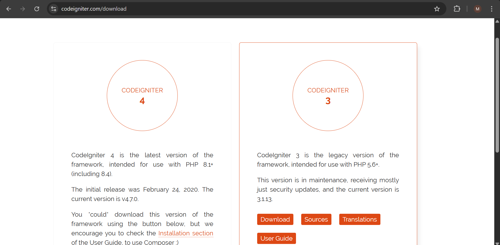


## Menjalankan CLI (Command Line Interface) 
Codeigniter 4 menyediakan CLI untuk mempermudah proses development. Untuk mengakses
CLI buka terminal/command prompt. Arahkan lokasi direktori sesuai dengan direktori kerja project dibuat 

Perintah yang dapat dijalankan untuk memanggil CLI CodeIgniter adalah: 

```
php spark
```

## Mengakftikan Mode Debugging 

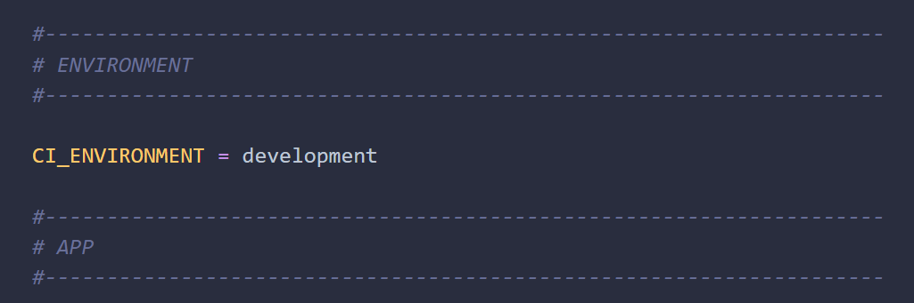

Untuk menampikan jenis error maka kita perlu mengaktikan mode debugging dengan mengubah nilai konfigurasi pada environment variable CI_ENVIRINMENT menjadi development. 

Ubah nama File env menjadi .env kemudian buka file tersebut dan ubah nilai variable  CI_ENVIRINMENT menjadi development. 

## Router dan Controller 

Router terletak pada file app/config/Routes.php 

Pada file tersebut kita dapat mendefinisikan route untuk aplikasi yang kita buat.
```
$routes->get('/', 'Home::index');
```

### Membuat Route Baru 

Tambahkan kode ini diddalam routes.php 
```
$routes->get('/about', 'Page::about');
$routes->get('/contact', 'Page::contact');
$routes->get('/faqs', 'Page::faqs');
```

Untuk mengetahui route yg ditambakan sudah benar atau belum, buka CLI dan jalankan perintah berikut 

```
php spark routes
```

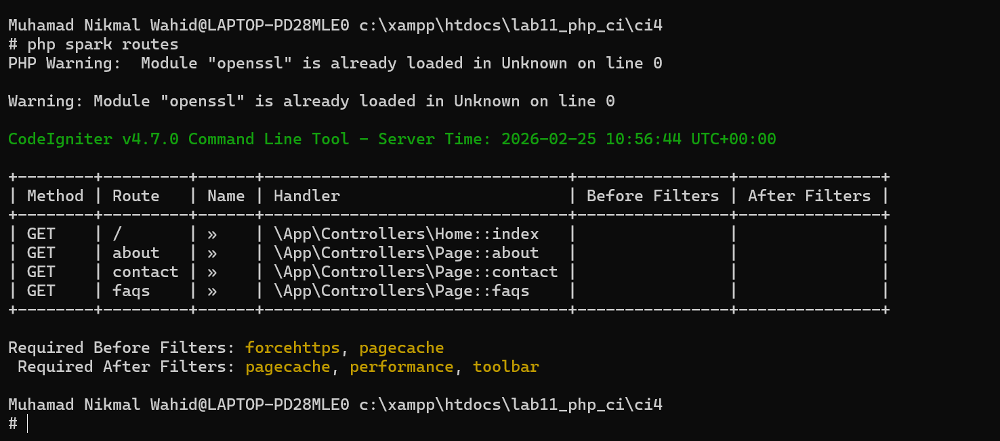


## Membuat Controller 

```
<?php

namespace App\Controllers;

class Page extends BaseController
{
    public function about()
    {
        echo "Ini halaman About";
    }

    public function contact()
    {
        echo "Ini halaman Contact";
    }

    public function faqs()
    {
        echo "Ini halaman FAQ";
    }
}
```

## Membuat View 

Buat File baru dengan nama about.php pada direktori (app/view/about.php)
```
<!DOCTYPE html>
<html lang="en">
<head>
    <meta charset="UTF-8">
    <title><?= $title; ?></title>
    <link rel="stylesheet" href="<?= base_url('styles.css'); ?>">
</head>
<body>

<?= $this->include('template/header.php'); ?>

<h1><?= esc($title); ?></h1>
<hr>
<p><?= esc($content); ?></p>

<?= $this->include('template/footer.php'); ?>

</body>
</html><!DOCTYPE html>
<html lang="en">
<head>
    <meta charset="UTF-8">
    <title><?= $title; ?></title>
    <link rel="stylesheet" href="<?= base_url('styles.css'); ?>">
</head>
<body>


<h1><?= esc($title); ?></h1>
<hr>
<p><?= esc($content); ?></p>


</body>
</html>
```

Ubah method pada abut di dalam class Controller page seperti berikut: 

```
 public function about()
    {
        return view('about', [
            'title' => 'Halaman About',
            'content' => 'Ini adalah halaman about yang menjelaskan tentang isi halaman ini.'
        ]);
    }
```

## Membuat Layout Header dan Footer 

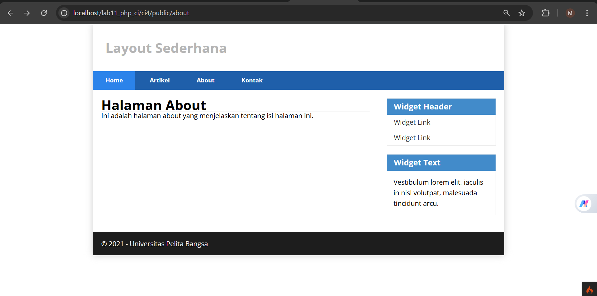

### Header 
```
<!DOCTYPE html>
<html lang="en">
<head>
    <meta charset="UTF-8">
    <title><?= $title; ?></title>
    <link rel="stylesheet" href="<?= base_url('styles.css');?>">
</head>
<body>
    <div id="container">
        <header>
            <h1>Layout Sederhana</h1>
        </header>
        <nav>
            <a href="<?= base_url('/');?>" class="active">Home</a>
            <a href="<?= base_url('/artikel');?>">Artikel</a>
            <a href="<?= base_url('/about');?>">About</a>
            <a href="<?= base_url('/contact');?>">Kontak</a>
        </nav>
<section id="wrapper">
<section id="main">
```

### Footer 
```
</section>

<aside id="sidebar">
    <div class="widget-box">
        <h3 class="title">Widget Header</h3>
        <ul>
            <li><a href="#">Widget Link</a></li>
            <li><a href="#">Widget Link</a></li>
        </ul>
    </div>

    <div class="widget-box">
        <h3 class="title">Widget Text</h3>
        <p>
            Vestibulum lorem elit, iaculis in nisl volutpat,
            malesuada tincidunt arcu.
        </p>
    </div>
</aside>

</section>

<footer>
    <p>&copy; 2021 - Universitas Pelita Bangsa</p>
</footer>

</div>
</body>
</html>
```

## Pertanyaan dan Tugas 

Lengkapi kode program untuk menu lainnya yang ada pada Controller Page, sehingga semua
link pada navigasi header dapat menampilkan tampilan dengan layout yang sama.

Jawaban: 

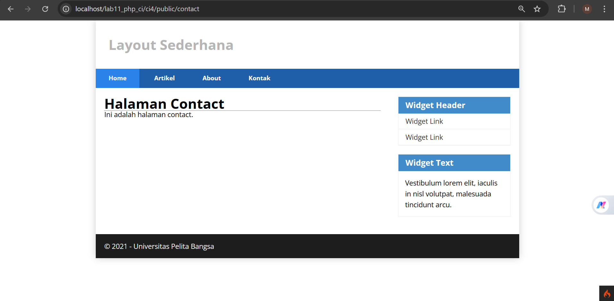

- Buat File baru di dalam direktori (app/view) buat beberapa file yg dibutuhkan misalnya contact.php dan kemudian isi dengan berikut:

```
<!DOCTYPE html>
<html lang="en">
<head>
    <meta charset="UTF-8">
    <title><?= $title; ?></title>
    <link rel="stylesheet" href="<?= base_url('styles.css'); ?>">
</head>
<body>

<?= $this->include('template/header.php'); ?>

<h1><?= esc($title); ?></h1>
<hr>
<p><?= esc($content); ?></p>

<?= $this->include('template/footer.php'); ?>

</body>
</html>
```

Kemudian ubah kode pada Controller Page

```
<?php

namespace App\Controllers;

class Page extends BaseController
{
    public function about()
    {
        return view('about', [
            'title' => 'Halaman About',
            'content' => 'Ini adalah halaman about yang menjelaskan tentang isi halaman ini.'
        ]);
    }

    public function contact()
    {
        return view('contact', [
            'title' => 'Halaman Contact',
            'content' => 'Ini adalah halaman contact.'
        ]);
    }

    public function artikel()
    {
        return view('artikel', [
            'title' => 'Halaman Artikel',
            'content' => 'Ini adalah halaman artikel.'
        ]);
    }

    public function faqs()
    {
        return view('faqs', [
            'title' => 'Halaman FAQ',
            'content' => 'Ini adalah halaman FAQ.'
        ]);
    }

    public function tos()
    {
        return view('tos', [
            'title' => 'Halaman Term of Services',
            'content' => 'Ini adalah halaman Term of Services.'
        ]);
    }
}
```
# Pratikum 2 - Pemrograman Web 2 (Framework Lanjutan CRUD) 

## Persiapan 
Untuk memulai pratikum membuat aplikasi CRUD sederhana, yang perlu disiapkan adalah database srver menggunakan MySQL. Pastikan MySQL dan apache sudah aktif 

## Membuat Database 
Setelah membuat itu kita membuat database dengan nama lab_ci4 setelah itu kita membat tabel 

## Koneksi Database 
Selanjutnya membuat konfigurasi database untuk menghubungkan dengan database server. Konfigurasi dapat dilakukan menggunakan file .env 

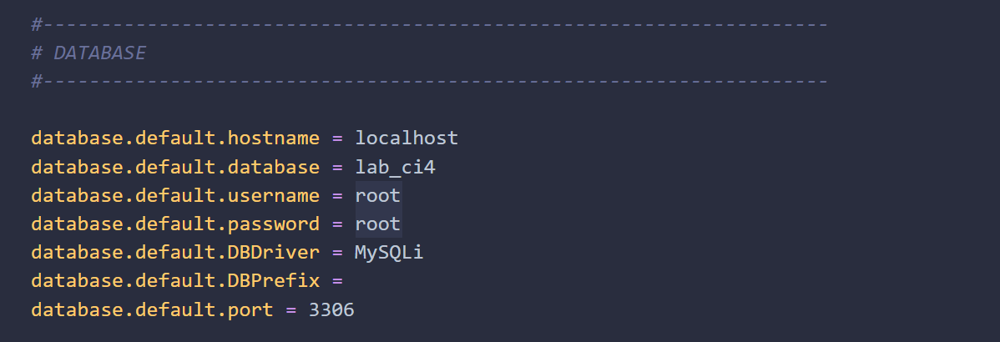

## Membuat Model 
Selanjutnya adalah membuat model untuk memproses data Artikel. Buat File baru pada direktori app/Models dengan nama ArtikelModel.php 

```
<?php
namespace App\Models;

use CodeIgniter\Model;

class ArtikelModel extends Model
{
    protected $table = 'artikel';
    protected $primaryKey = 'id';
    protected $useAutoIncrement = true;
    protected $allowedFields = ['judul', 'isi', 'status', 'slug',
    'gambar'];
}
```

## Membuat Controller 
Buatlah Controller baru dengan nama Artikel.php pada direktori app/Controllers

```
<?php 

namespace App\Controllers; 

use App\Models\ArtikelModel;

class Artikel extends BaseController 
{
    public function index()
    {
        $title = 'Daftar Artikel';
        $model = new ArtikelModel();
        $artikel = $model -> findAll();
        return view('artikel/index', compact('artikel', "title"));
    }
}
```

# Membuat view 
Membuat direktori baru dengan nama artikel pada direktori app/views, kemudian buat file baru dengan nama index.php.

```
<?= $this->include('template/header'); ?>

<?php if ($artikel): ?>
    
    <?php foreach ($artikel as $row): ?>
        
        <article class="entry">
            <h2>
                <a href="<?= base_url('/artikel/' . $row['slug']); ?>">
                    <?= $row['judul']; ?>
                </a>
            </h2>

            " 
                alt="<?= $row['judul']; ?>"
            >

            <p>
                <?= substr($row['isi'], 0, 200); ?>
            </p>
        </article>

        <hr class="divider" />

    <?php endforeach; ?>

<?php else: ?>

    <article class="entry">
        <h2>Belum ada data.</h2>
    </article>

<?php endif; ?>

<?= $this->include('template/footer'); ?>
```

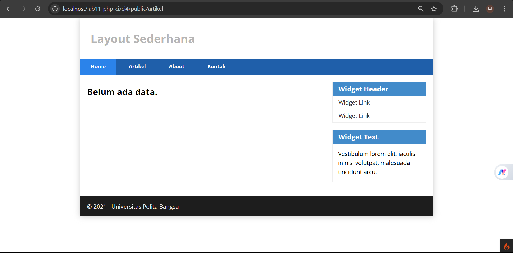 

Selanjutnya kita akan menambah beberapa data pada database agar dapat ditampilkan datanya. 

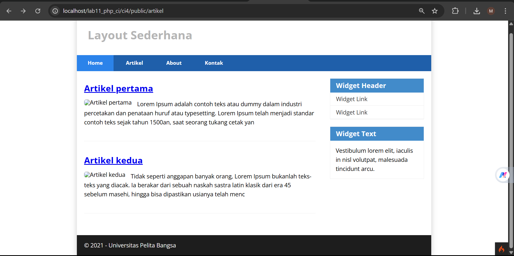

## Membuat Tampilan detail Artikel 

Tampilan pada saat judul berita di klik maka akan diarahkan ke halaman yg berbeda. 
```
  public function view($slug)
    {
        $model = new ArtikelModel();
        $artikel = $model ->where([
            'slug' => $slug
        ])->first();

        // error apabila tidak ada data 

        if (!$artikel)
            {
                throw PageNotFoundException:: forPageNotFound();
            }

            $title = $artikel['judul'];
            return view('artikel/detail', compact('artikel', 'title'));
    }
```

## Membuat View Detail 

```
<?= $this->include('template/header'); ?> 

<article class="entry">
    <h2><?= $artikel['judul']; ?></h2>
    " alt="<?=$artikel['judul']; ?>">
    <p><?= $artikel['isi']; ?></p>
</article>

<?= $this->include('template/footer'); ?> 
```
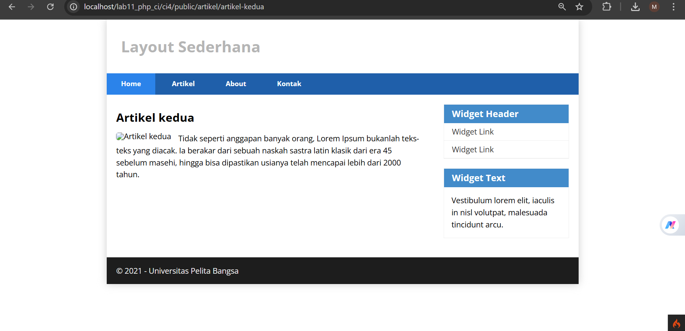

## Membuat Routing untuk artikel detail 
Membuat routing tambahan untuk artikel detail 
```
$routes->get('/artikel/(:any)', 'Artikel::view/$1');
```

## Membuat Menu Admin 
Menu Admin adalah untuk proses CRUD data. buat method baru pada COntroller artikel denngan nama method admin_index()
```
  public function admin_index()
    {
        $title = 'Daftar Artikel';
        $model = new ArtikelModel();
        $artikel = $model->findAll();
        return view('artikel/admin_index', compact('artikel', 'title'));
    }
```
Langkah selanjutnya adalah membuat tampilan admin dengan nama file admin_index.php
```
<?= $this->include('template/admin_header'); ?>

<table class="table">
    <thead>
        <tr>
            <th>ID</th>
            <th>Judul</th>
            <th>Status</th>
            <th>Aksi</th>
        </tr>
    </thead>
    <tbody>
        <?php if (!empty($artikel)) : ?>
            <?php foreach ($artikel as $row) : ?>
                <tr>
                    <td><?= $row['id']; ?></td>
                    <td>
                        <b><?= esc($row['judul']); ?></b>
                        <p>
                            <small><?= esc(substr($row['isi'], 0, 50)); ?>...</small>
                        </p>
                    </td>
                    <td><?= esc($row['status']); ?></td>
                    <td>
                        <a class="btn" href="<?= base_url('admin/artikel/edit/' . $row['id']); ?>">
                            Ubah
                        </a>

                        <a class="btn btn-danger"
                           onclick="return confirm('Yakin menghapus data?');"
                           href="<?= base_url('admin/artikel/delete/' . $row['id']); ?>">
                            Hapus
                        </a>
                    </td>
                </tr>
            <?php endforeach; ?>
        <?php else : ?>
            <tr>
                <td colspan="4" class="text-center">Belum ada data.</td>
            </tr>
        <?php endif; ?>
    </tbody>
    <tfoot>
        <tr>
            <th>ID</th>
            <th>Judul</th>
            <th>Status</th>
            <th>Aksi</th>
        </tr>
    </tfoot>
</table>

<?= $this->include('template/admin_footer'); ?>
```

kemudian tambah routing untuk menu admin 
```
$routes->group('admin', function($routes) {
    $routes->get('artikel', 'Artikel::admin_index');
    $routes->add('artikel/add', 'Artikel::add');
    $routes->add('artikel/edit/(:any)', 'Artikel::edit/$1');
    $routes->get('artikel/delete/(:any)', 'Artikel::delete/$1');
});
```

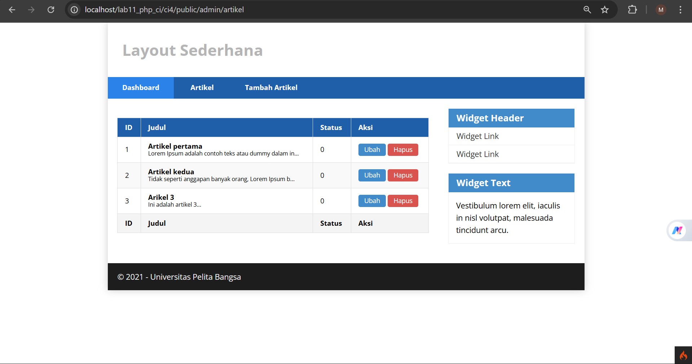

## Menambah Data Artikel 

```
public function add()
    {
        // Validasi input
        $validation = \Config\Services::validation();
        $validation->setRules([
            'judul' => 'required'
        ]);

        $isDataValid = $validation
            ->withRequest($this->request)
            ->run();

        if ($isDataValid)
        {
            $model = new ArtikelModel();

            $model->insert([
                'judul' => $this->request->getPost('judul'),
                'isi'   => $this->request->getPost('isi'),
                'slug'  => url_title(
                    $this->request->getPost('judul'),
                    '-', 
                    true
                ),
            ]);

            return redirect()->to('/admin/artikel');
        }

        $title = "Tambah Artikel";
        return view('artikel/form_add', compact('title'));
    }
```
Kemudian agar bisa melihat form tambah kita harus membuat file baru bernama form_add.php 

```
<?= $this->include('template/admin_header'); ?>

<h2><?= $title; ?></h2>
<form action="" method="post">
    <p>
    <input type="text" name="judul">
    </p>

    <p>
    <textarea name="isi" cols="50" rows="10"></textarea>
    </p>
    <p><input type="submit" value="Kirim" class="btn btn-large"></p>
</form>
<?= $this->include('template/admin_footer'); ?>
```

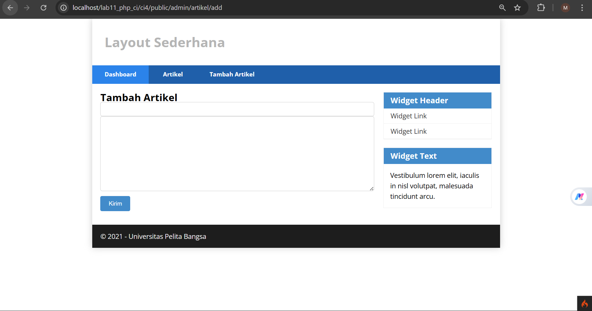

## Mengubah Data 
Tambahkan method baru pada controller dengan nama edit()
```
 public function edit($id)
    {
        $model = new ArtikelModel();

        // Ambil data lama terlebih dahulu
        $data = $model->find($id);

        if (!$data) {
            throw new \CodeIgniter\Exceptions\PageNotFoundException("Data tidak ditemukan");
        }

        // Validasi input
        $validation = \Config\Services::validation();
        $validation->setRules([
            'judul' => 'required'
        ]);

        $isDataValid = $validation
            ->withRequest($this->request)
            ->run();

        if ($isDataValid)
        {
            $model->update($id, [
                'judul' => $this->request->getPost('judul'),
                'isi'   => $this->request->getPost('isi'),
                'slug'  => url_title(
                    $this->request->getPost('judul'),
                    '-', 
                    true
                ),
            ]);

            return redirect()->to('/admin/artikel');
        }

        $title = "Edit Artikel";
        return view('artikel/form_edit', compact('title', 'data'));
    }
```

Membuat view edit dengan cara membuat file baru dengan nama form_edit.php 
```
<?= $this->include('template/admin_header'); ?>

<h2><?= esc($title); ?></h2>

<form action="" method="post">
    
    <?= csrf_field(); ?>

    <p>
        <input 
            type="text" 
            name="judul" 
            value="<?= esc($data['judul']); ?>" 
            required
        >
    </p>

    <p>
        <textarea 
            name="isi" 
            cols="50" 
            rows="10"
        ><?= esc($data['isi']); ?></textarea>
    </p>

    <p>
        <input 
            type="submit" 
            value="Kirim" 
            class="btn btn-large"
        >
    </p>

</form>

<?= $this->include('template/admin_footer'); ?>
```
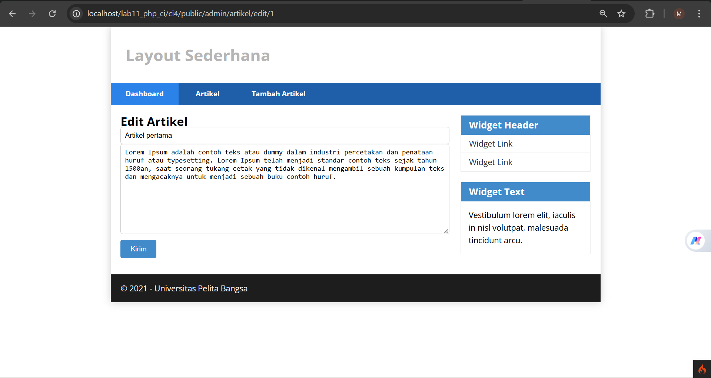

## Menghapus Data 
```
public function delete($id)
{
    $artikel = new ArtikelModel();

    $artikel->delete($id);

    return redirect()->to('/admin/artikel');
}
```

## Pernyataan dan Tugas

Selesaikan programnya sesuai Langkah-langkah yang ada. Anda boleh melakukan improvisasi.

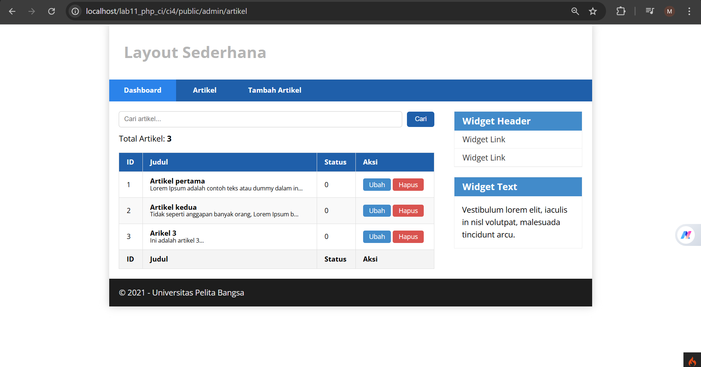

Improvisasi yang saya lakukan adalah menambahkan total artikel serta fitur search agar memudahkan dalam mencari artikel

# Pratikum 3 - View Layout dan View Cell 

Pratikum 3 menggunakan konsep View Layout dan View Cell untuk memudahkan dalam penggunaan layout. 

### Membuat Layout utama 

Buat folder layout di dalam app/views/, kemudian membuat file main.php di dalam folder layout dengan kode berikut. 

```
<!DOCTYPE html>
<html lang="en">
<head>
    <meta charset="UTF-8">
    <title><?= $title ?? 'My Website' ?></title>
    <link rel="stylesheet" href="<?= base_url('styles.css'); ?>">
</head>
<body>
    <div id="container">
        
        <header>
            <h1>Layout Sederhana</h1>
        </header>

        <nav>
            <a href="<?= base_url('/'); ?>" class="active">Home</a>
            <a href="<?= base_url('/artikel'); ?>">Artikel</a>
            <a href="<?= base_url('/about'); ?>">About</a>
            <a href="<?= base_url('/contact'); ?>">Kontak</a>
        </nav>

        <section id="wrapper">
            
            <section id="main">
                <?= $this->renderSection('content') ?>
            </section>

            <aside id="sidebar">
                
                <?= view_cell('App\\Cells\\ArtikelTerkini::show') ?>

                <div class="widget-box">
                    <h3 class="title">Widget Header</h3>
                    <ul>
                        <li><a href="#">Widget Link</a></li>
                        <li><a href="#">Widget Link</a></li>
                    </ul>
                </div>

                <div class="widget-box">
                    <h3 class="title">Widget Text</h3>
                    <p>
                        Vestibulum lorem elit, iaculis in nisl volutpat,
                        malesuada tincidunt arcu. Proin in leo fringilla,
                        vestibulum mi porta, faucibus felis. Integer pharetra
                        est nunc, nec pretium nunc pretium ac.
                    </p>
                </div>

            </aside>

        </section>

        <footer>
            <p>&copy; 2021 - Universitas Pelita Bangsa</p>
        </footer>

    </div>
</body>
</html> 
```

### Modifikasi File View 

Ubah app/Views/home.php agar sesuai dengan layout baru 

```
<?= $this->extend('layout/main') ?>

<?= $this->section('content') ?>

<h1><?= $title; ?></h1>
<hr>
<p><?= $content; ?></p>

<?= $this->endSection() ?>
```

### Menampilkan Data Dinamis dengan VIew Cell 

View Cell adalah sebuah konsep untuk membuat komponen tampilan (view) yang bersifat modular, reusable, dan memiliki logika tersendiri tanpa harus membebani controller utama.

### Membuat Class View Cell 

Buat folder Cells di dalam app/, kemudian file ArtikelTerkini.php di dalam app/Cells dengan kode berikut.

```
<?php

namespace App\Cells;

use CodeIgniter\View\Cell;
use App\Models\ArtikelModel;

class ArtikelTerkini extends Cell
{
    public function render()
    {
        $model = new ArtikelModel();

        $artikel = $model->orderBy('created_at', 'DESC')
                         ->limit(5)
                         ->findAll();

        return view('components/artikel_terkini', [
            'artikel' => $artikel
        ]);
    }
}
```

### Membuat View untuk View Cell 

Buat Folder components di dalam app/Views/, Kemudian buat file artikel_terkini.php di dalam app/Views/components dengan kode berikut: 

```
<h3>Artikel Terkini</h3>

<ul>
    <?php foreach ($artikel as $row): ?>
        <li>
            <a href="<?= base_url('/artikel/' . $row['slug']) ?>">
                <?= $row['judul'] ?>
            </a>
        </li>
    <?php endforeach; ?>
</ul>
```

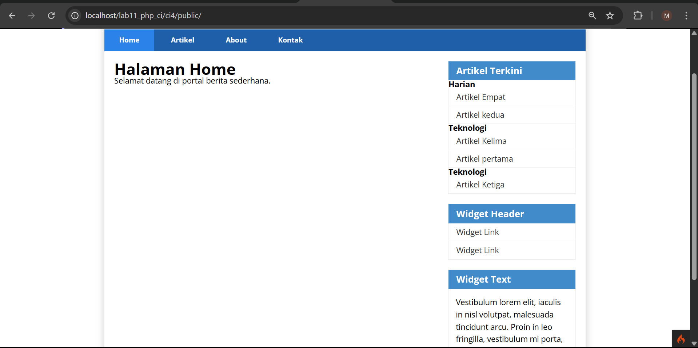

### Pertanyaan dan Tugas 

- Sesuaikan data dengan praktikum sebelumnya, perlu melakukan perubahan field pada
database dengan menambahkan tanggal agar dapat mengambil data artikel terbaru.


- Selesaikan programnya sesuai Langkah-langkah yang ada. Anda boleh melakukan
improvisasi.

- Apa manfaat utama dari penggunaan View Layout dalam pengembangan aplikasi?
  
  View Layout adalah template utama (master page) yang digunakan untuk membungkus konten halaman agar konsisten di seluruh aplikasi. Terdapat beberapa manfaat penggunaan view layout yaitu konsistensi UI/UX, Efisisnesi Development, Maintainability (Kemudahan Maintenance), Separation of Concerns (SoC), ntegrasi Komponen Lebih Mudah

- Jelaskan perbedaan antara View Cell dan View biasa.

  View Biasa adalah File tampilan yang hanya bertugas menampilkan data dari controller. Sedangkan View Cell adalah Komponen view yang memiliki logic sendiri (mini-controller) dan dapat mengambil data secara mandiri

# Pratikum 4 - Framework Lanjutan (Modul Login)

Pada pratikum 4 ini akan membuat modul login, hal yang perlu disiapkan adalah database  menggunakan MySQL. 

### Membuat Tabel User 

```
CREATE TABLE user (
    id INT(11) auto_increment,
    username VARCHAR(200) NOT NULL,
    useremail VARCHAR(200),
    userpassword VARCHAR(200),
    PRIMARY KEY(id)
);
```

### Membuat Model User 

```
<?php

namespace App\Models;

use CodeIgniter\Model;

class UserModel extends Model
{
    protected $table = 'user';
    protected $primaryKey = 'id';
    protected $useAutoIncrement = true;
    protected $allowedFields = ['username', 'useremail', 'userpassword'];
}
```
### Membuat Controller User

Langkah Selanjutnya membuat Controller baru dengan nama User.php pada direktori app/controllers. Kemudian tambahkan method index() untuk menampilkan daftar user dan method login() untuk proses login. 

```
<?php
namespace App\Controllers;

use App\Models\UserModel;

class User extends BaseController
{
    public function index()
    {
        $title = 'Daftar User';
        $model = new UserModel();
        $users = $model->findAll();

        return view('user/index', compact('users', 'title'));
    }

    public function login()
    {
        helper(['form']);

        $email = $this->request->getPost('email');
        $password = $this->request->getPost('password');

        if (!$email) {
            return view('/login');
        }

        $session = session();
        $model = new UserModel();
        $login = $model->where('useremail', $email)->first();

        if ($login) {
            $pass = $login['userpassword'];

            if (password_verify($password, $pass)) {
                $login_data = [
                    'user_id' => $login['id'],
                    'user_name' => $login['username'],
                    'user_email' => $login['useremail'],
                    'logged_in' => TRUE,
                ];

                $session->set($login_data);

                return redirect()->to('admin/artikel');
            } else {
                $session->setFlashdata("flash_msg", "Password salah.");
                return redirect()->to('/login');
            }
        } else {
            $session->setFlashdata("flash_msg", "Email tidak terdaftar.");
            return redirect()->to('/user/login');
        }
    }
}
```

### Membuat View Login 

Pada direktori app/views buat file baru dengan nama login.php 

```
<!DOCTYPE html>
<html lang="en">
<head>
    <meta charset="UTF-8">
    <title><?= $title ?? 'My Website' ?></title>
    <link rel="stylesheet" href="<?= base_url('styles.css'); ?>">
</head>
<body>
    <div id="container">
        
        <header>
            <h1>Layout Sederhana</h1>
        </header>

        <nav>
            <a href="<?= base_url('/'); ?>" class="active">Home</a>
            <a href="<?= base_url('/artikel'); ?>">Artikel</a>
            <a href="<?= base_url('/about'); ?>">About</a>
            <a href="<?= base_url('/contact'); ?>">Kontak</a>
        </nav>

        <section id="wrapper">
            
            <section id="main">
                <?= $this->renderSection('content') ?>
            </section>

            <aside id="sidebar">
                
                <?= view_cell('App\\Cells\\ArtikelTerkini::show') ?>

                <div class="widget-box">
                    <h3 class="title">Widget Header</h3>
                    <ul>
                        <li><a href="#">Widget Link</a></li>
                        <li><a href="#">Widget Link</a></li>
                    </ul>
                </div>

                <div class="widget-box">
                    <h3 class="title">Widget Text</h3>
                    <p>
                        Vestibulum lorem elit, iaculis in nisl volutpat,
                        malesuada tincidunt arcu. Proin in leo fringilla,
                        vestibulum mi porta, faucibus felis. Integer pharetra
                        est nunc, nec pretium nunc pretium ac.
                    </p>
                </div>

            </aside>

        </section>

        <footer>
            <p>&copy; 2021 - Universitas Pelita Bangsa</p>
        </footer>

    </div>
</body>
</html> 
```

### Membuat Database Seeder

Dalam konteks pengembangan aplikasi (terutama pada framework seperti CodeIgniter), Database Seeder adalah mekanisme untuk mengisi database dengan data awal (dummy atau default) secara otomatis. Untuk mengaktifkan database seeder kita perlu membuka CLI dan menulis kan perintah sebagai berikut ```php spark make:seeder UserSeeder```

Langkah Selanjutnya adalah mengisi file UserSeeder.php yang berada di lokasi direktori, lalu isi dengan kode berikut. 

```
<?php

namespace App\Database\Seeds;

use CodeIgniter\Database\Seeder;
use App\Models\UserModel;

class UserSeeder extends Seeder
{
    public function run()
    {
        $model = new UserModel();

        $model->insert([
            'username'     => 'admin',
            'useremail'    => 'admin@email.com',
            'userpassword' => password_hash('admin123', PASSWORD_DEFAULT),
        ]);
    }
}
```

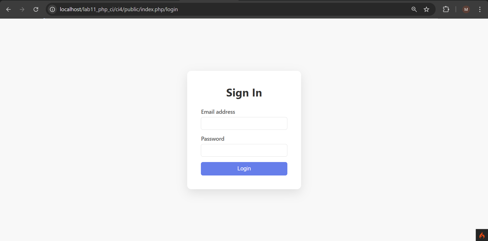

Setelah kita mengisi file UserSeeds dengan kode tersebut langkah selanjutnya adalah kembali membuka CLI dan ketik perintah berikut: 

```
php spark db:seed UserSeeder
```

### Menambahkan Auth Filter 

```
<?php

namespace App\Filters;

use CodeIgniter\HTTP\RequestInterface;
use CodeIgniter\HTTP\ResponseInterface;
use CodeIgniter\Filters\FilterInterface;

class Auth implements FilterInterface
{
    public function before(RequestInterface $request, $arguments = null)
    {
        // jika user belum login
        if (!session()->get('logged_in')) {
            // maka redirect ke halaman login
            return redirect()->to('/user/login');
        }
    }

    public function after(RequestInterface $request, ResponseInterface $response, $arguments = null)
    {
        // Do something here
    }
}
```

Selanjutnya buka file app/Config/Filter.php tambahkan kode ini 

```
'auth' => App\Filters\Auth::class
```

### Percobaan Akses Menu Admin 


### Fungai Logout

```
public function logout()
{
    session()->destroy();
    return redirect()->to('/user/login');
}
```

# 📘 Praktikum 5 — Pagination dan Pencarian

> Pemrograman Web menggunakan Framework CodeIgniter 4

---

# 📚 Daftar Isi

- [Pendahuluan](#pendahuluan)
- [Teori Dasar](#teori-dasar)
  - [1. Pagination](#1-pagination)
  - [2. Pencarian (Search)](#2-pencarian-search)
- [Langkah-langkah Praktikum](#langkah-langkah-praktikum)
  - [1. Membuat Pagination](#1-membuat-pagination)
  - [2. Membuat Pencarian](#2-membuat-pencarian)
  - [3. Mengintegrasikan Search dan Pagination](#3-mengintegrasikan-search-dan-pagination)
  - [4. Membuat Custom Pagination](#4-membuat-custom-pagination)
- [Hasil Pengujian](#hasil-pengujian)
- [Improvisasi](#improvisasi)
- [Pertanyaan dan Tugas](#pertanyaan-dan-tugas)
- [Kesimpulan](#kesimpulan)

---

# Pendahuluan

Pada praktikum ini dilakukan pengembangan fitur pada aplikasi berbasis **CodeIgniter 4** dengan menambahkan fitur:

- Pagination
- Pencarian data (*search*)
- Custom pagination

Fitur-fitur tersebut bertujuan untuk meningkatkan efisiensi pengelolaan data, mempercepat proses pencarian informasi, serta meningkatkan kenyamanan pengguna ketika mengakses data dalam jumlah besar.

Implementasi dilakukan pada halaman admin artikel sehingga data artikel dapat dibatasi per halaman dan dicari berdasarkan kata kunci tertentu.

---

# Teori Dasar

## 1. Pagination

Pagination adalah teknik yang digunakan untuk membagi data dalam jumlah besar menjadi beberapa halaman yang lebih kecil. Teknik ini umum digunakan pada aplikasi web maupun mobile untuk meningkatkan performa sistem dan mempermudah navigasi data.

### Tujuan dan Fungsi Pagination

| No | Fungsi |
|----|---------|
| 1 | Meningkatkan performa aplikasi |
| 2 | Mengurangi waktu loading |
| 3 | Mempermudah navigasi data |
| 4 | Membuat tampilan lebih rapi |
| 5 | Menghemat penggunaan sumber daya server |

Dengan pagination, sistem tidak perlu memuat seluruh data sekaligus sehingga proses rendering halaman menjadi lebih ringan dan efisien.

---

## 2. Pencarian (Search)

Pencarian atau *search* merupakan fitur yang digunakan untuk menemukan data tertentu berdasarkan kata kunci (*keyword*) yang dimasukkan oleh pengguna.

Fitur ini biasanya diintegrasikan dengan database menggunakan query filtering sehingga hanya data yang relevan yang akan ditampilkan.

### Tujuan dan Fungsi Pencarian

| No | Fungsi |
|----|---------|
| 1 | Mempercepat pencarian data |
| 2 | Meningkatkan efisiensi penggunaan aplikasi |
| 3 | Mempermudah akses informasi |
| 4 | Meningkatkan pengalaman pengguna |
| 5 | Membantu pengelolaan data dalam jumlah besar |

---

# Langkah-langkah Praktikum

## 1. Membuat Pagination

Untuk membuat pagination, buka kembali Controller `Artikel` kemudian modifikasi method `admin_index()` menjadi seperti berikut:

```php
public function admin_index()
{
    $title = 'Daftar Artikel';

    $model = new ArtikelModel();

    $data = [
        'title'   => $title,
        'artikel' => $model->paginate(10),
        'pager'   => $model->pager,
    ];

    return view('artikel/admin_index', $data);
}
```

### Penjelasan

| Kode | Fungsi |
|------|---------|
| `paginate(10)` | Membatasi jumlah data sebanyak 10 record per halaman |
| `$model->pager` | Mengambil objek pagination |
| `return view()` | Mengirim data ke halaman view |

---

Selanjutnya buka file:

```bash
app/Views/artikel/admin_index.php
```

Tambahkan kode berikut di bawah tabel data:

```php
<?= $pager->links(); ?>
```

Kode tersebut digunakan untuk menampilkan navigasi pagination secara otomatis.

---

# 2. Membuat Pencarian

Tambahkan form pencarian pada file:

```bash
app/Views/artikel/admin_index.php
```

```php
<form method="get" class="admin-search">

    <input 
        type="text" 
        name="q" 
        placeholder="Cari artikel..."
    >

    <button type="submit" class="btn">
        Cari
    </button>

</form>
```

### Penjelasan

| Komponen | Fungsi |
|-----------|---------|
| `method="get"` | Mengirim keyword melalui URL |
| `name="q"` | Menyimpan keyword pencarian |
| `button submit` | Menjalankan proses pencarian |

---

# 3. Mengintegrasikan Search dan Pagination

Agar pagination tetap berjalan ketika pencarian dilakukan, ubah kode pagination menjadi:

```php
<?= $pager->only(['q'])->links(); ?>
```

Kode tersebut berfungsi untuk mempertahankan parameter pencarian (`q`) ketika pengguna berpindah halaman pagination.

---

## Modifikasi Controller

Controller juga dimodifikasi agar mendukung pencarian dan perhitungan total data secara dinamis.

```php
public function admin_index()
{
    $model = new ArtikelModel();

    $q = $this->request->getGet('q');

    if ($q) {
        $model->like('judul', $q);
    }

    $artikel = $model->paginate(2);

    $pager = $model->pager;

    // Total data sesuai kondisi
    if ($q) {
        $total = $model->like('judul', $q)
                       ->countAllResults();
    } else {
        $total = $model->countAll();
    }

    return view('artikel/admin_index', [
        'title'   => 'Daftar Artikel',
        'artikel' => $artikel,
        'pager'   => $pager,
        'total'   => $total,
        'q'       => $q
    ]);
}
```

---

## Penjelasan Program

| Bagian | Fungsi |
|--------|---------|
| `$this->request->getGet('q')` | Mengambil keyword pencarian |
| `like('judul', $q)` | Memfilter data berdasarkan judul |
| `paginate(2)` | Membatasi data sebanyak 2 artikel per halaman |
| `countAllResults()` | Menghitung total hasil pencarian |
| `countAll()` | Menghitung seluruh data artikel |

---

# 4. Membuat Custom Pagination

Custom pagination digunakan untuk memodifikasi tampilan pagination agar lebih menarik dan mudah dikustomisasi.

Buat folder berikut:

```bash
app/Views/Pager
```

Kemudian buat file:

```bash
custom_pagination.php
```

Isi file tersebut dengan kode berikut:

```php
<ul class="pagination-custom">

    <?php foreach ($pager->links() as $link) : ?>

        <li class="<?= $link['active'] ? 'active' : '' ?>">

            <a href="<?= $link['uri'] ?>">
                <?= $link['title'] ?>
            </a>

        </li>

    <?php endforeach ?>

</ul>
```

---

## Menambahkan CSS Pagination

```css
.pagination-custom {
    list-style: none;
    display: flex;
    gap: 8px;
    padding: 0;
    margin-top: 30px;
}

.pagination-custom li a {
    padding: 6px 12px;
    background: #eee;
    text-decoration: none;
    border-radius: 6px;
    color: black;
}

.pagination-custom li.active a {
    background: #007bff;
    color: white;
}
```

---

## Menggunakan Custom Pagination

Ubah kode pagination menjadi:

```php
<?= $pager->links('default', 'custom_pagination'); ?>
```

---

# Hasil Pengujian

## Tampilan Search dan Pagination

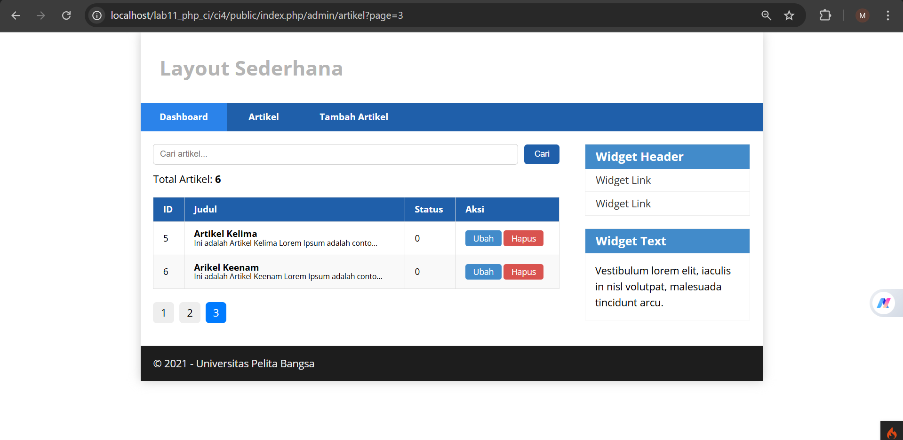

### Hasil yang Diperoleh

- Pagination berhasil membatasi jumlah data per halaman
- Pencarian artikel berjalan dengan baik
- Pagination tetap aktif ketika proses pencarian dilakukan
- Tampilan pagination menjadi lebih menarik setelah menggunakan custom pagination

---

# Improvisasi

Pada praktikum ini dilakukan beberapa pengembangan tambahan, yaitu:

- Menampilkan total artikel
- Mengintegrasikan search dengan pagination
- Mengoptimalkan proses filtering data
- Membuat custom pagination

Proses pencarian dilakukan menggunakan parameter HTTP GET kemudian difilter menggunakan metode `like()` pada Query Builder.

Pagination diterapkan menggunakan metode `paginate()` sehingga sistem hanya menampilkan sebagian data sesuai kebutuhan. Pendekatan ini membantu mengurangi beban server sekaligus meningkatkan efisiensi aplikasi.

Selain itu, jumlah total data dihitung menggunakan:

- `countAll()` untuk seluruh data
- `countAllResults()` untuk hasil pencarian

Dengan integrasi tersebut, sistem menjadi lebih:

- Efisien
- Responsif
- Terstruktur
- Mudah digunakan

---

# Pertanyaan dan Tugas

Selesaikan program sesuai langkah-langkah praktikum yang diberikan. Mahasiswa diperbolehkan melakukan improvisasi terhadap tampilan maupun logika program untuk meningkatkan kualitas aplikasi.

---

# Kesimpulan

Berdasarkan praktikum yang telah dilakukan, dapat disimpulkan bahwa:

1. Pagination membantu meningkatkan performa aplikasi dengan membatasi jumlah data yang ditampilkan.
2. Fitur pencarian mempermudah pengguna menemukan data tertentu secara cepat.
3. Integrasi search dan pagination membuat sistem lebih efisien dalam mengelola data besar.
4. Custom pagination meningkatkan kualitas antarmuka aplikasi agar lebih modern dan mudah digunakan.
5. Query Builder pada CodeIgniter 4 mempermudah proses manipulasi data secara aman dan terstruktur.

---

# 📌 Praktikum 5 — Pagination dan Pencarian

### Pemrograman Web | Framework CodeIgniter 4

# 🗄️ Praktikum 6 — Relasi Tabel dan Query Builder
 
## Daftar Isi
 
- [Pendahuluan](#pendahuluan)
- [Teori Dasar](#teori-dasar)
  - [1. Model dalam CodeIgniter](#1-model-dalam-codeigniter)
  - [2. Relasi Antar Tabel](#2-relasi-antar-tabel)
  - [3. Query Builder](#3-query-builder)
- [Langkah-langkah Praktikum](#langkah-langkah-praktikum)
  - [1. Membuat Tabel Kategori](#1-membuat-tabel-kategori)
  - [2. Mengubah Tabel Artikel](#2-mengubah-tabel-artikel)
  - [3. Membuat Model Kategori](#3-membuat-model-kategori)
  - [4. Memodifikasi ArtikelModel.php](#4-memodifikasi-artikelmodelphp)
  - [5. Memodifikasi Controller Artikel](#5-memodifikasi-controller-artikel)
  - [6. Memodifikasi View](#6-memodifikasi-view)
  - [7. Memodifikasi form_add dan form_edit](#7-memodifikasi-form_add-dan-form_edit)
  - [8. Testing](#8-testing)
- [Pertanyaan dan Tugas](#pertanyaan-dan-tugas)
---
 
## Pendahuluan
 
Praktikum ini merupakan tahap lanjutan dari pembelajaran sebelumnya yang berfokus pada penguatan pemahaman terhadap arsitektur aplikasi berbasis **MVC (Model-View-Controller)**, khususnya pada aspek:
 
- Pengelolaan data menggunakan Model
- Implementasi relasi antar tabel
- Pemanfaatan Query Builder dalam framework CodeIgniter 4
Pendekatan ini bertujuan untuk meningkatkan efisiensi dan skalabilitas dalam pengembangan aplikasi berbasis database.
 
---
 
## Teori Dasar
 
### 1. Model dalam CodeIgniter
 
Model merupakan komponen inti dalam pola arsitektur MVC yang berfungsi sebagai lapisan penghubung antara aplikasi dan database. Melalui Model, seluruh operasi terhadap data dapat dilakukan secara terstruktur, meliputi:
 
| Operasi | Keterangan |
|---------|------------|
| **Retrieve** | Pengambilan data dari database |
| **Insert** | Penyimpanan data baru |
| **Update** | Pembaruan data yang sudah ada |
| **Delete** | Penghapusan data |
 
Dengan adanya Model, logika pengolahan data menjadi terpisah dari View dan Controller, sehingga meningkatkan modularitas dan maintainability kode.
 
---
 
### 2. Relasi Antar Tabel
 
Relasi tabel digunakan untuk membangun keterkaitan logis antara dua atau lebih tabel dalam sebuah database relasional. Pada praktikum ini digunakan pendekatan **One-to-Many relationship**, di mana:
 
- Satu entitas **kategori** dapat memiliki lebih dari satu entitas **artikel**
- Relasi diimplementasikan dengan menambahkan **foreign key** (`id_kategori`) pada tabel anak (artikel) yang merujuk ke primary key pada tabel induk (kategori)
Dengan struktur ini, integritas data dapat terjaga dan redundansi dapat diminimalkan.
 
---
 
### 3. Query Builder
 
Query Builder adalah fitur CodeIgniter untuk menyusun query database tanpa menulis sintaks SQL secara langsung. Operasi yang dapat dilakukan antara lain:
 
- **Join** — penggabungan tabel
- **Filtering** — penyaringan data
- **Ordering** — pengurutan data
- **Pagination** — pembatasan hasil per halaman
Pendekatan ini meningkatkan efisiensi penulisan kode, mengurangi risiko kesalahan sintaks, serta meningkatkan keamanan terhadap serangan **SQL Injection**.
 
---
 
## Langkah-langkah Praktikum
 
### 1. Membuat Tabel Kategori
 
Jalankan query SQL berikut untuk membuat tabel `kategori`:
 
```sql
CREATE TABLE kategori (
    id_kategori INT(11) AUTO_INCREMENT,
    nama_kategori VARCHAR(100) NOT NULL,
    slug_kategori VARCHAR(100),
    PRIMARY KEY (id_kategori)
);
```
 
---
 
### 2. Mengubah Tabel Artikel
 
Menambahkan foreign key `id_kategori` pada tabel `artikel` untuk membuat relasi dengan tabel `kategori`:
 
```sql
ALTER TABLE artikel
ADD COLUMN id_kategori INT(11),
ADD CONSTRAINT fk_kategori_artikel
FOREIGN KEY (id_kategori) REFERENCES kategori(id_kategori);
```
 
---
 
### 3. Membuat Model Kategori
 
Buat file model baru di `app/Models/KategoriModel.php`:
 
```php
<?php
namespace App\Models;
use CodeIgniter\Model;
 
class KategoriModel extends Model
{
    protected $table          = 'kategori';
    protected $primaryKey     = 'id_kategori';
    protected $useAutoIncrement = true;
    protected $allowedFields  = ['nama_kategori', 'slug_kategori'];
}
```
 
---
 
### 4. Memodifikasi ArtikelModel.php
 
**`app/Models/ArtikelModel.php`**
 
```php
<?php
 
namespace App\Models;
 
use CodeIgniter\Model;
 
class ArtikelModel extends Model
{
   protected $table            = 'artikel';
   protected $primaryKey       = 'id';
   protected $useAutoIncrement = true;
   protected $allowedFields    = ['judul', 'isi', 'status', 'slug', 'gambar', 'id_kategori'];
 
   public function getArtikelDenganKategori()
   {
      return $this->db->table('artikel')
                  ->select('artikel.*, kategori.nama_kategori')
                  ->join('kategori', 'kategori.id_kategori = artikel.id_kategori')
                  ->get()
                  ->getResultArray();
   }
}
```
 
**Penjelasan:**
 
| Bagian | Keterangan |
|--------|------------|
| `id_kategori` di `$allowedFields` | Menambahkan foreign key agar bisa diisi/diupdate |
| `select()` | Mengambil semua kolom artikel + `nama_kategori` dari tabel kategori |
| `join()` | Menghubungkan tabel `artikel` dan `kategori` berdasarkan `id_kategori` |
| `getResultArray()` | Mengembalikan hasil query dalam bentuk array |
 
---
 
### 5. Memodifikasi Controller Artikel
 
**`app/Controllers/Artikel.php`**
 
```php
<?php 
 
namespace App\Controllers; 
 
use App\Models\ArtikelModel;   
use App\Models\KategoriModel;
use CodeIgniter\Exceptions\PageNotFoundException;
 
class Artikel extends BaseController 
{
    public function index()
    {
        $title = 'Daftar Artikel';
        $model = new ArtikelModel();
 
        $artikel = $model
            ->select('artikel.*, kategori.nama_kategori')
            ->join('kategori', 'kategori.id_kategori = artikel.id_kategori', 'left')
            ->findAll();
 
        return view('artikel/index', compact('artikel', 'title'));
    }
 
    public function view($slug)
    {
        $model = new ArtikelModel();
 
        $artikel = $model
            ->select('artikel.*, kategori.nama_kategori')
            ->join('kategori', 'kategori.id_kategori = artikel.id_kategori', 'left')
            ->where('slug', $slug)
            ->first();
 
        if (!$artikel) {
            throw \CodeIgniter\Exceptions\PageNotFoundException::forPageNotFound();
        }
 
        $title = $artikel['judul'];
 
        return view('artikel/detail', compact('artikel', 'title'));
    }
 
    public function admin_index()
    {
        $model         = new ArtikelModel();
        $kategoriModel = new KategoriModel();
 
        $q           = $this->request->getGet('q');
        $kategori_id = $this->request->getGet('kategori_id');
 
        $builder = $model->select('artikel.*, kategori.nama_kategori')
            ->join('kategori', 'kategori.id_kategori = artikel.id_kategori', 'left');
 
        if ($q) {
            $builder->like('artikel.judul', $q);
        }
 
        if ($kategori_id) {
            $builder->where('artikel.id_kategori', $kategori_id);
        }
 
        $artikel = $builder->paginate(2);
        $pager   = $model->pager;
 
        return view('artikel/admin_index', [
            'title'       => 'Daftar Artikel',
            'artikel'     => $artikel,
            'pager'       => $pager,
            'q'           => $q,
            'kategori_id' => $kategori_id,
            'kategori'    => $kategoriModel->findAll()
        ]);
    }
 
    public function add()
    {
        $validation = \Config\Services::validation();
        $validation->setRules([
            'judul' => 'required'
        ]);
 
        $isDataValid = $validation
            ->withRequest($this->request)
            ->run();
 
        if ($isDataValid)
        {
            $model = new ArtikelModel();
 
            $model->insert([
                'judul'       => $this->request->getPost('judul'),
                'isi'         => $this->request->getPost('isi'),
                'id_kategori' => $this->request->getPost('id_kategori'),
                'slug'        => url_title(
                    $this->request->getPost('judul'),
                    '-', 
                    true
                ),
            ]);
 
            return redirect()->to('/admin/artikel');
        }
 
        $title         = "Tambah Artikel";
        $kategoriModel = new KategoriModel();
 
        return view('artikel/form_add', [
            'title'    => $title,
            'kategori' => $kategoriModel->findAll()
        ]);
    }
 
    public function edit($id)
    {
        $model         = new ArtikelModel();
        $kategoriModel = new KategoriModel();
 
        $artikel = $model->find($id);
 
        if (!$artikel) {
            throw new \CodeIgniter\Exceptions\PageNotFoundException("Data tidak ditemukan");
        }
 
        $validation = \Config\Services::validation();
        $validation->setRules([
            'judul' => 'required'
        ]);
 
        $isDataValid = $validation
            ->withRequest($this->request)
            ->run();
 
        if ($isDataValid)
        {
            $model->update($id, [
                'judul'       => $this->request->getPost('judul'),
                'isi'         => $this->request->getPost('isi'),
                'id_kategori' => $this->request->getPost('id_kategori'),
                'slug'        => url_title(
                    $this->request->getPost('judul'),
                    '-', 
                    true
                ),
            ]);
 
            return redirect()->to('/admin/artikel');
        }
 
        return view('artikel/form_edit', [
            'title'    => 'Edit Artikel',
            'artikel'  => $artikel,
            'kategori' => $kategoriModel->findAll()
        ]);
    }
 
    public function delete($id)
    {
        $artikel = new ArtikelModel();
 
        $artikel->delete($id);
 
        return redirect()->to('/admin/artikel');
    }
 
    public function render(string $kategori = null)
    {
        $model = new ArtikelModel();
 
        $query = $model
            ->select('artikel.*, kategori.nama_kategori')
            ->join('kategori', 'kategori.id_kategori = artikel.id_kategori', 'left')
            ->orderBy('artikel.id', 'DESC');
 
        if ($kategori) {
            $query->where('kategori.nama_kategori', $kategori);
        }
 
        $artikel = $query->limit(5)->findAll();
 
        return view('components/artikel_terkini', [
            'artikel'  => $artikel,
            'kategori' => $kategori 
        ]);
    }
}
```
 
---
 
### 6. Memodifikasi View
 
**`app/Views/artikel/index.php`**
 
```php
<?= $this->include('template/header'); ?>
 
<?php if ($artikel): ?>
 
    <?php foreach ($artikel as $row): ?>
 
        <article class="entry">
            <h2>
                <a href="<?= base_url('/artikel/' . $row['slug']); ?>">
                    <?= esc($row['judul']); ?>
                </a>
            </h2>
 
            <p>
                Kategori: <?= esc($row['nama_kategori']); ?>
            </p>
 
            " 
                alt="<?= esc($row['judul']); ?>"
            >
 
            <p>
                <?= esc(substr($row['isi'], 0, 200)); ?>...
            </p>
        </article>
 
        <hr class="divider" />
 
    <?php endforeach; ?>
 
<?php else: ?>
 
    <article class="entry">
        <h2>Belum ada data.</h2>
    </article>
 
<?php endif; ?>
 
<?= $this->include('template/footer'); ?>
```
 
> 💡 **Catatan:** Baris `<p>Kategori: <?= esc($row['nama_kategori']); ?></p>` ditambahkan untuk menampilkan nama kategori hasil JOIN dari `ArtikelModel`.
 
---
 
**`app/Views/artikel/admin_index.php`**
 
```php
<?= $this->include('template/admin_header'); ?>
 
<h2><?= esc($title); ?></h2>
 
<!-- SEARCH + FILTER -->
<form method="get" class="admin-search">
    
    <input 
        type="text" 
        name="q" 
        value="<?= esc($q); ?>" 
        placeholder="Cari artikel..."
        class="search-input"
    >
 
    <select name="kategori_id" class="search-select">
        <option value="">Semua Kategori</option>
        <?php foreach ($kategori as $k): ?>
            <option 
                value="<?= $k['id_kategori']; ?>" 
                <?= ($kategori_id == $k['id_kategori']) ? 'selected' : ''; ?>
            >
                <?= esc($k['nama_kategori']); ?>
            </option>
        <?php endforeach; ?>
    </select>
 
    <button type="submit" class="btn search-btn">Cari</button>
 
</form>
 
<p>Total Artikel: <b><?= $total ?? count($artikel); ?></b></p>
 
<table class="table">
    <thead>
        <tr>
            <th>ID</th>
            <th>Judul</th>
            <th>Kategori</th>
            <th>Status</th>
            <th>Aksi</th>
        </tr>
    </thead>
 
    <tbody>
        <?php if (!empty($artikel)) : ?>
            <?php foreach ($artikel as $row) : ?>
                <tr>
                    <td><?= $row['id']; ?></td>
 
                    <td>
                        <b><?= esc($row['judul']); ?></b>
                        <p>
                            <small><?= esc(substr($row['isi'], 0, 50)); ?>...</small>
                        </p>
                    </td>
 
                    <td><?= esc($row['nama_kategori']); ?></td>
 
                    <td><?= esc($row['status']); ?></td>
 
                    <td>
                        <a class="btn" href="<?= base_url('admin/artikel/edit/' . $row['id']); ?>">
                            Ubah
                        </a>
 
                        <a 
                            class="btn btn-danger"
                            onclick="return confirm('Yakin menghapus data?');"
                            href="<?= base_url('admin/artikel/delete/' . $row['id']); ?>"
                        >
                            Hapus
                        </a>
                    </td>
                </tr>
            <?php endforeach; ?>
        <?php else : ?>
            <tr>
                <td colspan="5" class="text-center">Tidak ada data.</td>
            </tr>
        <?php endif; ?>
    </tbody>
</table>
 
<!-- PAGINATION -->
<?= $pager->links('default', 'custom_pagination') ?>
 
<?= $this->include('template/admin_footer'); ?>
```
 
---
 
### 7. Memodifikasi form_add dan form_edit
 
**`app/Views/artikel/form_add.php`**
 
```php
<?= $this->include('template/admin_header'); ?>
 
<h2><?= $title; ?></h2>
 
<form action="" method="post">
    
    <p>
        <label for="judul">Judul</label><br>
        <input type="text" name="judul" id="judul" required>
    </p>
 
    <p>
        <label for="isi">Isi</label><br>
        <textarea name="isi" id="isi" cols="50" rows="10"></textarea>
    </p>
 
    <p>
        <label for="id_kategori">Kategori</label><br>
        <select name="id_kategori" id="id_kategori" required>
            <?php foreach ($kategori as $k): ?>
                <option value="<?= $k['id_kategori']; ?>">
                    <?= $k['nama_kategori']; ?>
                </option>
            <?php endforeach; ?>
        </select>
    </p>
 
    <p>
        <input type="submit" value="Kirim" class="btn btn-large">
    </p>
 
</form>
 
<?= $this->include('template/admin_footer'); ?>
```
 
---
 
**`app/Views/artikel/form_edit.php`**
 
```php
<?= $this->include('template/admin_header'); ?>
 
<h2><?= $title; ?></h2>
 
<form action="" method="post">
 
    <p>
        <label for="judul">Judul</label><br>
        <input type="text" name="judul" id="judul" 
               value="<?= $artikel['judul']; ?>" required>
    </p>
 
    <p>
        <label for="isi">Isi</label><br>
        <textarea name="isi" id="isi" cols="50" rows="10">
<?= $artikel['isi']; ?>
        </textarea>
    </p>
 
    <p>
        <label for="id_kategori">Kategori</label><br>
        <select name="id_kategori" id="id_kategori" required>
            <?php foreach ($kategori as $k): ?>
                <option value="<?= $k['id_kategori']; ?>"
                    <?= ($artikel['id_kategori'] == $k['id_kategori']) ? 'selected' : ''; ?>>
                    <?= $k['nama_kategori']; ?>
                </option>
            <?php endforeach; ?>
        </select>
    </p>
 
    <p>
        <input type="submit" value="Kirim" class="btn btn-large">
    </p>
 
</form>
 
<?= $this->include('template/admin_footer'); ?>
```
 
> 💡 **Catatan:** Dropdown kategori diambil dari database. Admin memilih kategori saat menambah atau mengedit artikel. Pada form edit, opsi yang sesuai dengan kategori artikel saat ini akan otomatis `selected`.
 
---
 
### 8. Testing
 
Lakukan uji coba untuk memastikan semua fungsi berjalan dengan baik:
 
**Menampilkan daftar artikel dengan nama kategori**
 
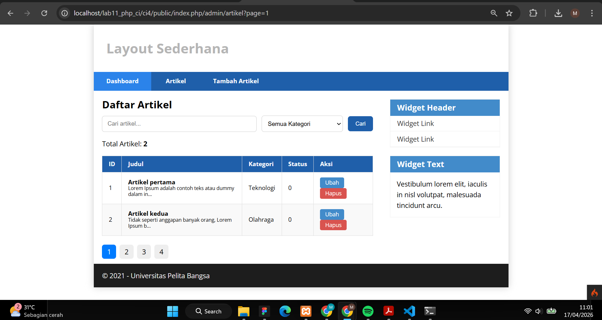
 
**Menambah artikel baru dengan memilih kategori**
 
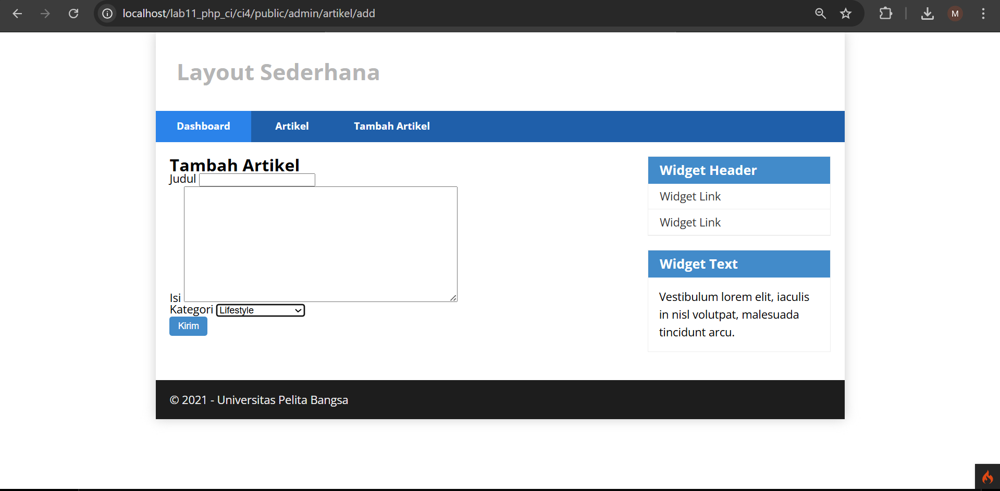
 
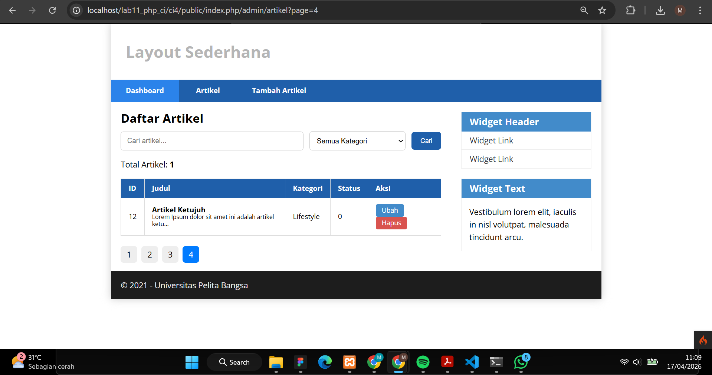
 
**Mengedit artikel dan mengubah kategorinya**
 
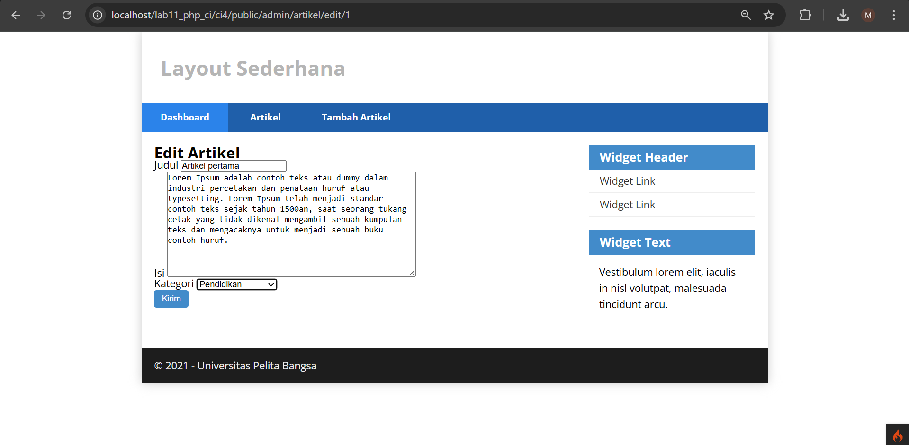
 
**Menghapus artikel** — pastikan data terhapus dan tidak muncul di daftar.
 
---
 
## Pertanyaan dan Tugas
 
### 1. Selesaikan semua langkah praktikum di atas.
 
### 2. Modifikasi tampilan detail artikel untuk menampilkan nama kategori
 
**`app/Views/artikel/detail.php`**
 
```php
<?= $this->include('template/header'); ?> 
 
<article class="entry">
    <h2><?= esc($artikel['judul']); ?></h2>
 
    <p>
        <b>Kategori:</b> <?= esc($artikel['nama_kategori'] ?? 'Tidak ada'); ?>
    </p>
 
    " 
        alt="<?= esc($artikel['judul']); ?>"
    >
 
    <p><?= esc($artikel['isi']); ?></p>
</article>
 
<?= $this->include('template/footer'); ?>
```
 
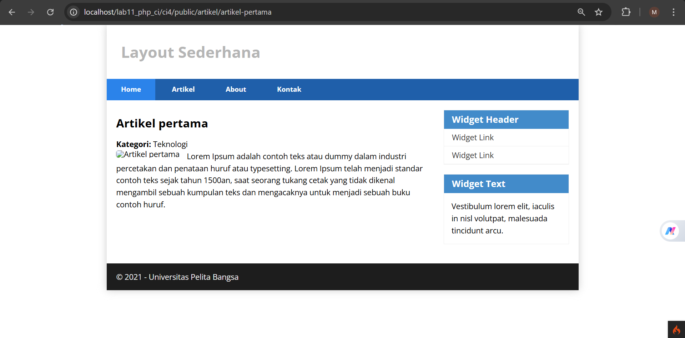
 
---
 
### 3. Tambahkan fitur menampilkan daftar kategori di halaman depan *(opsional)*
 
**`app/Views/artikel/index.php`**
 
```php
<?= $this->include('template/header'); ?>
 
<?php if ($artikel): ?>
 
    <?php foreach ($artikel as $row): ?>
 
        <article class="entry">
            <h2>
                <a href="<?= base_url('/artikel/' . $row['slug']); ?>">
                    <?= esc($row['judul']); ?>
                </a>
            </h2>
 
            <p>
                Kategori: <?= esc($row['nama_kategori']); ?>
            </p>
 
            " 
                alt="<?= esc($row['judul']); ?>"
            >
 
            <p>
                <?= esc(substr($row['isi'], 0, 200)); ?>...
            </p>
        </article>
 
        <hr class="divider" />
 
    <?php endforeach; ?>
 
<?php else: ?>
 
    <article class="entry">
        <h2>Belum ada data.</h2>
    </article>
 
<?php endif; ?>
 
<?= $this->include('template/footer'); ?>
```
 
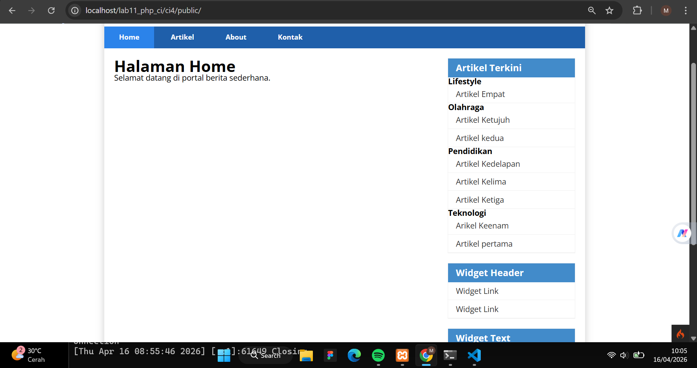
 
---
 
### 4. Buat fungsi untuk menampilkan artikel berdasarkan kategori tertentu *(opsional)*
 
Fungsi `render()` sudah tersedia di Controller Artikel dan dapat dipanggil dengan parameter nama kategori untuk memfilter artikel yang ditampilkan berdasarkan kategori yang dipilih.
 
---
 
*Laporan Praktikum 6 — Relasi Tabel dan Query Builder | Pemrograman Web*

# 📷 Praktikum 7 — Upload Gambar File

## Daftar Isi

- [Upload Gambar pada Artikel](#upload-gambar-pada-artikel)
- [Hasil](#hasil)
- [Pertanyaan dan Tugas](#pertanyaan-dan-tugas)
  - [1. Upload Gambar pada Form Edit](#1-upload-gambar-pada-form-edit)
  - [2. Menampilkan Gambar pada Tabel](#2-menampilkan-gambar-pada-tabel)

---

## Upload Gambar pada Artikel

Menambahkan fungsi upload gambar pada program. Buka kembali **Controller Artikel**, lalu sesuaikan kode pada method `add()` seperti berikut:

**`app/Controllers/Artikel.php` — method `add()`**
```php
public function add()
{
    // Validasi data
    $validation = \Config\Services::validation();
    $validation->setRules([
        'judul' => 'required'
    ]);

    $isDataValid = $validation
        ->withRequest($this->request)
        ->run();

    if ($isDataValid) {

        // Ambil file upload
        $file = $this->request->getFile('gambar');

        // Pindahkan file ke folder public/gambar
        $file->move(ROOTPATH . 'public/gambar');

        // Simpan ke database
        $artikel = new ArtikelModel();
        $artikel->insert([
            'judul'  => $this->request->getPost('judul'),
            'isi'    => $this->request->getPost('isi'),
            'slug'   => url_title(
                $this->request->getPost('judul'),
                '-',
                true
            ),
            'gambar' => $file->getName(),
        ]);

        return redirect()->to('admin/artikel');
    }

    // Jika validasi gagal
    $title = "Tambah Artikel";
    return view('artikel/form_add', compact('title'));
}
```

Kemudian tambahkan field input file pada view form tambah artikel:

**`app/Views/artikel/form_add.php`**
```html
<p>
    <input type="file" name="gambar">
</p>
```

Sesuaikan tag `<form>` dengan menambahkan `enctype` agar bisa mengirim file:

```html
<form action="" method="post" enctype="multipart/form-data">
```

> ⚠️ **Penting:** Atribut `enctype="multipart/form-data"` wajib ada agar browser dapat mengirim file bersama data form.

---

## Hasil

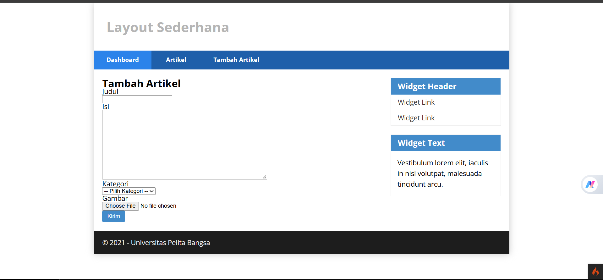

---

## Pertanyaan dan Tugas

Selesaikan program sesuai langkah-langkah yang ada. Diperbolehkan melakukan improvisasi.

---

### 1. Upload Gambar pada Form Edit

Langkah pertama adalah mengubah method `edit()` pada Controller Artikel agar mendukung upload gambar baru sekaligus menghapus gambar lama secara otomatis.

**`app/Controllers/Artikel.php` — method `edit()`**
```php
public function edit($id)
{
    $model         = new ArtikelModel();
    $kategoriModel = new KategoriModel();

    $artikel = $model->find($id);

    if (!$artikel) {
        throw new \CodeIgniter\Exceptions\PageNotFoundException("Data tidak ditemukan");
    }

    $validation = \Config\Services::validation();
    $validation->setRules([
        'judul' => 'required'
    ]);

    $isDataValid = $validation
        ->withRequest($this->request)
        ->run();

    if ($isDataValid) {
        $file = $this->request->getFile('gambar');

        // Gunakan gambar lama sebagai default
        $namaGambar = $artikel['gambar'];

        // Jika ada gambar baru yang diupload
        if ($file && $file->isValid() && !$file->hasMoved()) {

            $namaGambar = $file->getRandomName();
            $file->move(ROOTPATH . 'public/gambar', $namaGambar);

            // Hapus gambar lama dari server
            if (!empty($artikel['gambar']) &&
                file_exists(ROOTPATH . 'public/gambar/' . $artikel['gambar'])) {
                unlink(ROOTPATH . 'public/gambar/' . $artikel['gambar']);
            }
        }

        $model->update($id, [
            'judul'       => $this->request->getPost('judul'),
            'isi'         => $this->request->getPost('isi'),
            'id_kategori' => $this->request->getPost('id_kategori'),
            'gambar'      => $namaGambar,
            'slug'        => url_title(
                $this->request->getPost('judul'),
                '-',
                true
            ),
        ]);

        return redirect()->to('/admin/artikel');
    }

    return view('artikel/form_edit', [
        'title'    => 'Edit Artikel',
        'artikel'  => $artikel,
        'kategori' => $kategoriModel->findAll()
    ]);
}
```

Kemudian tambahkan tampilan gambar lama dan field upload gambar baru pada view form edit:

**`app/Views/artikel/form_edit.php`**
```html
<p>
    <label>Gambar Lama</label><br>
    <?php if (!empty($artikel['gambar'])): ?>
        " width="150">
    <?php else: ?>
        Tidak ada gambar
    <?php endif; ?>
</p>

<p>
    <label>Ganti Gambar</label><br>
    <input type="file" name="gambar">
</p>

<p>
    <input type="submit" value="Update" class="btn btn-large">
</p>
```

> 💡 **Catatan:** Jika pengguna tidak memilih gambar baru, sistem akan tetap menggunakan gambar lama. Gambar lama akan otomatis dihapus dari server saat diganti dengan gambar baru.

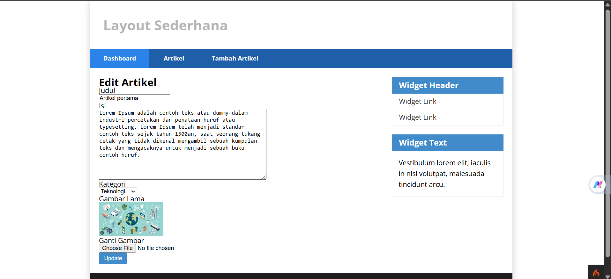

---

### 2. Menampilkan Gambar pada Tabel

Agar gambar yang sudah ditambahkan atau diedit bisa ditampilkan di halaman daftar artikel, tambahkan kolom `<td>` berikut pada tabel:

**`app/Views/artikel/index.php` (bagian tabel)**
```html
<td>
    "
        width="80"
        height="60"
        style="object-fit: cover; border-radius: 5px;"
    >
</td>
```

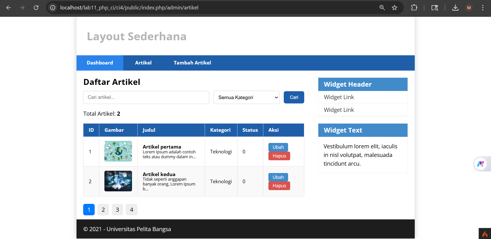

---

*Laporan Praktikum 7 — Upload Gambar File | Pemrograman Web*


# Pratikum 8: AJAX
# 📡 AJAX — Asynchronous JavaScript and XML
 
## Daftar Isi
 
- [Pengertian AJAX](#pengertian-ajax)
- [Cara Kerja AJAX](#cara-kerja-ajax)
- [Komponen Utama AJAX](#komponen-utama-ajax)
- [Contoh Penggunaan](#contoh-penggunaan)
  - [1. Menggunakan XMLHttpRequest (Cara Lama)](#1-menggunakan-xmlhttprequest-cara-lama)
  - [2. Menggunakan Fetch API (Modern)](#2-menggunakan-fetch-api-modern)
  - [3. Menggunakan jQuery AJAX](#3-menggunakan-jquery-ajax)
  - [4. Menggunakan Axios](#4-menggunakan-axios)
- [Kelebihan dan Kekurangan](#kelebihan-dan-kekurangan)
- [Kesimpulan](#kesimpulan)
---
 
## Pengertian AJAX
 
**AJAX** (*Asynchronous JavaScript and XML*) adalah sekumpulan teknik pengembangan web yang memungkinkan aplikasi web berkomunikasi dengan server secara **asinkron** (di latar belakang) tanpa perlu memuat ulang (*reload*) halaman secara keseluruhan.
 
Meskipun namanya mengandung kata "XML", data yang dikirim dan diterima tidak terbatas pada format XML saja. Saat ini, format **JSON** (*JavaScript Object Notation*) jauh lebih umum digunakan karena lebih ringan dan mudah diproses oleh JavaScript.
 
> **Singkatnya:** AJAX memungkinkan halaman web untuk memperbarui sebagian konten secara dinamis tanpa harus me-refresh seluruh halaman.
 
### Sejarah Singkat
 
| Tahun | Peristiwa |
|-------|-----------|
| 1999  | Microsoft memperkenalkan `XMLHttpRequest` di Internet Explorer 5 |
| 2004  | Google menggunakan teknik ini pada Gmail & Google Maps |
| 2005  | Jesse James Garrett mempopulerkan istilah "AJAX" |
| Kini  | Digantikan/disempurnakan oleh Fetch API, Axios, dan lainnya |
 
---
 
## Cara Kerja AJAX
 
Berikut alur kerja AJAX secara keseluruhan:
 
```
┌─────────────┐        1. Event (klik, input, dll.)       ┌─────────────┐
│             │ ─────────────────────────────────────────▶ │             │
│   Browser   │        2. XMLHttpRequest / Fetch           │   Server    │
│  (Client)   │ ─────────────────────────────────────────▶ │  (Backend)  │
│             │                                             │             │
│             │ ◀───────────────────────────────────────── │             │
│             │        3. Response (JSON / XML / HTML)      │             │
└─────────────┘                                             └─────────────┘
       │
       │  4. JavaScript memproses response
       │  5. DOM diperbarui tanpa reload halaman
       ▼
┌─────────────┐
│  Halaman    │
│  Diperbarui │
└─────────────┘
```

### Langkah-langkah Detail
 
1. **Event Terjadi** — Pengguna melakukan aksi (klik tombol, mengetik di kolom pencarian, scroll, dll.)
2. **Objek AJAX Dibuat** — JavaScript membuat objek `XMLHttpRequest` atau menggunakan `fetch()`
3. **Request Dikirim** — Request HTTP (GET, POST, PUT, DELETE) dikirim ke server secara **asinkron**
4. **Server Memproses** — Server menerima request, mengambil/mengolah data (database, API, dll.)
5. **Response Dikembalikan** — Server mengirim response dalam format JSON, XML, HTML, atau teks
6. **Callback Dijalankan** — JavaScript menerima response dan menjalankan fungsi callback
7. **DOM Diperbarui** — Halaman diperbarui sebagian sesuai data yang diterima

## Komponen Utama AJAX
 
| Komponen | Peran |
|----------|-------|
| **HTML/CSS** | Tampilan antarmuka pengguna |
| **JavaScript** | Logika pengiriman request dan pemrosesan response |
| **XMLHttpRequest / Fetch API** | Objek/metode untuk komunikasi HTTP |
| **Server-side (PHP, Node.js, dll.)** | Memproses request dan mengembalikan data |
| **Format Data (JSON/XML)** | Format pertukaran data antara client dan server |
 
---

## Kelebihan dan Kekurangan
 
### ✅ Kelebihan
 
- **Pengalaman Pengguna Lebih Baik** — Halaman tidak perlu reload penuh, terasa lebih responsif seperti aplikasi desktop
- **Hemat Bandwidth** — Hanya data yang dibutuhkan yang dikirim/diterima, bukan seluruh halaman
- **Performa Lebih Cepat** — Server hanya memproses sebagian data, bukan seluruh halaman HTML
- **Pemisahan Concerns** — Frontend dan backend dapat dikembangkan secara terpisah
- **Interaktivitas Tinggi** — Memungkinkan fitur seperti live search, notifikasi real-time, infinite scroll
### ❌ Kekurangan
 
- **Masalah SEO** — Konten yang dimuat secara dinamis sulit diindeks oleh mesin pencari
- **Tombol Back Browser** — Navigasi bisa bermasalah karena URL tidak selalu berubah
- **Ketergantungan JavaScript** — Tidak berfungsi jika JavaScript dinonaktifkan di browser
- **Kompleksitas Debugging** — Lebih sulit di-debug dibandingkan request halaman biasa
- **Keamanan** — Rentan terhadap serangan seperti XSS dan CSRF jika tidak ditangani dengan benar
---
 
## Kesimpulan
 
AJAX adalah fondasi dari pengalaman web modern yang kita nikmati sehari-hari — mulai dari pencarian Google yang muncul otomatis, feed media sosial yang ter-update tanpa refresh, hingga form yang tervalidasi secara real-time.
 
Pilihan implementasi AJAX bergantung pada kebutuhan proyek:
 
| Kebutuhan | Rekomendasi |
|-----------|-------------|
| Proyek sederhana / vanilla JS | `fetch()` dengan async/await |
| Sudah menggunakan jQuery | `$.ajax()` atau shorthand jQuery |
| Proyek besar / fitur lengkap | **Axios** |
| Perlu support browser lama | `XMLHttpRequest` |

